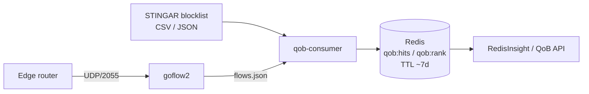
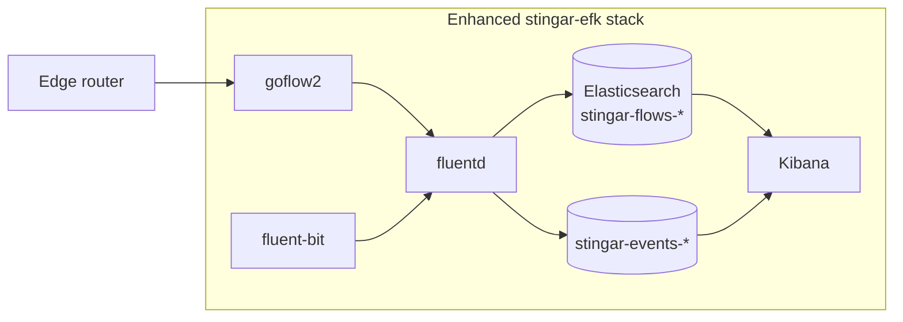

# Edge Router to STINGAR NetFlow / sFlow Integration

**Default platform:** Cisco IOS-XE (Flexible NetFlow), as the most common platform across STINGAR's customer base. Step 1 also has full sections for Juniper JunOS, Arista EOS, MikroTik RouterOS, and HPE Aruba CX, plus brief reference entries for Cisco Meraki, Huawei VRP, VyOS, pfSense / OPNsense, and Ubiquiti EdgeRouter. All platforms target the same goflow2 listener; Step 2 (goflow2) is shared; **Step 2b (Redis)** or **Step 3 (Elasticsearch)** is chosen per customer. The receiving side is STINGAR's `stingar-efk` stack extended with a [goflow2](https://pkg.go.dev/github.com/netsampler/goflow2/v3) sidecar container.

**Scope:** End-to-end configuration for connecting a customer edge router to a STINGAR management server so that NetFlow / IPFIX / sFlow telemetry is decoded by goflow2 and stored for blocking-impact visibility. Two **sink profiles** are documented:

| Profile | Steps | Best for |
| --- | --- | --- |
| **A — Redis (QoB)** | Step 2 + **Step 2b** | Per-IP `bh_hits` / `bh_bytes`, ~7-day TTL, QoB scoring; keeps the flow firehose off Elasticsearch |
| **B — Elasticsearch (Kibana)** | Step 2 + **Step 3** | Ad-hoc flow drill-down, Kibana dashboards, longer retention |

Step 1 (router export), Step 2 (goflow2), Step 4 (firewall), and Step 5 (validation) apply to both profiles. See [`Flow_Collector.md`](./Flow_Collector.md) for when to pick each profile.

This document operationalizes [`Flow_Collector.md`](./Flow_Collector.md) and the producer-side discussion in [`black_hole_logging.md`](./black_hole_logging.md). It is intentionally a "what to type, in what order" reference rather than a design document.

**Context for STINGAR operators:** customers who feed STINGAR blocklist / BGP-RTBH intel into their edge routers need flow telemetry to close the loop on "what got blackholed, and how much?" The join key is the **STINGAR blocklist export** (CSV or JSON with `cidr`, `indicator_id`, `added`, `removed`) — the same shape as BHR `publist.csv` used in [`qob/ingest/bhr_list.py`](../qob/ingest/bhr_list.py).

---

## Target topology

Step 1 and Step 2 are identical for both profiles. Pick **one** sink path after goflow2 decodes flows to JSON.

### Profile A — Redis (QoB / blocking-impact counters)



### Profile B — Elasticsearch (Kibana dashboards)



Honeypot events continue through the existing fluent-bit path unchanged. Profile B adds fluentd ingest for raw flows; Profile A adds a Python consumer that **joins flows to the blocklist at ingest** and only stores per-IP counters in Redis.

---

## Step 1: Edge router flow exporter configuration

Pick the subsection for your edge-router platform. Each one targets the same goflow2 listener (UDP/2055 for NetFlow / IPFIX, UDP/6343 for sFlow); the rest of the pipeline (Step 2 onwards) is identical regardless of the source platform.

### Step 1a: Cisco IOS-XE (recommended default)

Flexible NetFlow (FNF) is the modern Cisco syntax and supports both NetFlow v9 and IPFIX. Run all of this in `configure terminal` mode on the router.

```cisco
! Define what data the router collects per flow.
flow record STINGAR-RECORD
 description STINGAR-fed flow record for security telemetry
 match ipv4 protocol
 match ipv4 source address
 match ipv4 destination address
 match transport source-port
 match transport destination-port
 collect interface input
 collect interface output
 collect counter bytes
 collect counter packets
 collect timestamp sys-uptime first
 collect timestamp sys-uptime last
 collect ipv4 dscp
 collect ipv4 ttl minimum
 collect ipv4 ttl maximum

! Define where to send the flow data -- STINGAR's goflow2 listener.
flow exporter STINGAR-EXPORT
 description STINGAR-efk flow telemetry
 destination 10.20.30.40
 source GigabitEthernet0/0/0
 transport udp 2055
 export-protocol netflow-v9
 template data timeout 60
 option interface-table timeout 300
 option exporter-stats timeout 300
 option sampler-table

! Tie the record and the exporter together as a flow monitor.
flow monitor STINGAR-MON
 description STINGAR-fed monitor
 record STINGAR-RECORD
 exporter STINGAR-EXPORT
 cache timeout active 60
 cache timeout inactive 15

! Optional: sample 1:1000. Recommended above ~500 Mbps of underlying traffic.
sampler STINGAR-SAMPLER
 mode random 1 out-of 1000

! Attach the monitor to every interface you want visibility on -- both
! directions. The "input" attachment is what catches traffic destined for
! Null0 (blackholed) so this matters for the BGP-RTBH integration.
interface GigabitEthernet0/0/0
 ip flow monitor STINGAR-MON sampler STINGAR-SAMPLER input
 ip flow monitor STINGAR-MON sampler STINGAR-SAMPLER output
interface GigabitEthernet0/0/1
 ip flow monitor STINGAR-MON sampler STINGAR-SAMPLER input
 ip flow monitor STINGAR-MON sampler STINGAR-SAMPLER output

! Direct flow monitoring of Null0 -- this is THE key piece for the BGP-RTBH
! integration. Every flow whose final destination is the blackhole appears
! in this stream. Requires IOS-XE 16.6+.
interface Null0
 ip flow monitor STINGAR-MON output

! sFlow (optional, mostly for cat9k / nexus). Skip on classic ISRs.
sflow collector 10.20.30.40 vrf default udp-port 6343
sflow sampling-rate 4096
sflow source-interface Loopback0
interface GigabitEthernet0/0/0
 sflow enable
```

Two Cisco-specific gotchas:

- **Sampler attachment is per-interface**, not global. Easy to forget and accidentally export unsampled flows on a 10 Gb link, which will overrun the goflow2 receiver and the fluentd ingest.
- **`flow monitor` on `Null0`** only works on IOS-XE 16.6+. On older 12.x / 15.x, you get blackhole visibility only via the ingress monitor and have to filter for `egress_ifindex = Null0` on the collector side. (See the "Older Cisco platforms" appendix at the bottom.)

### Step 1b: Juniper JunOS (MX / PTX / EX / QFX)

Juniper's NetFlow equivalent is **IPFIX via Inline-JFlow** on MX and PTX routers (hardware-accelerated, line-rate) and **sampled-JFlow** on older M-series routing-engine-based deployments. sFlow is native on EX and QFX switches.

#### IPFIX configuration (MX / PTX)

```junos
chassis {
    fpc 0 {
        sampling-instance STINGAR-SAMPLE;
    }
}

services {
    flow-monitoring {
        version-ipfix {
            template STINGAR-IPV4 {
                flow-active-timeout 60;
                flow-inactive-timeout 15;
                template-refresh-rate seconds 60;
                ipv4-template;
            }
        }
    }
}

forwarding-options {
    sampling {
        instance {
            STINGAR-SAMPLE {
                input {
                    rate 1000;
                }
                family inet {
                    output {
                        flow-server 10.20.30.40 {
                            port 2055;
                            version-ipfix {
                                template {
                                    STINGAR-IPV4;
                                }
                            }
                        }
                        inline-jflow {
                            source-address 192.0.2.1;
                        }
                    }
                }
            }
        }
    }
}

interfaces {
    ge-0/0/0 {
        unit 0 {
            family inet {
                sampling {
                    input;
                    output;
                }
            }
        }
    }
}
```

#### sFlow configuration (EX / QFX switches)

```junos
protocols {
    sflow {
        polling-interval 0;
        sample-rate {
            ingress 1000;
            egress 1000;
        }
        collector 10.20.30.40 {
            udp-port 6343;
        }
        source-ip 192.0.2.1;
        interfaces ge-0/0/0;
        interfaces ge-0/0/1;
    }
}
```

#### JunOS gotchas

- **Inline-JFlow requires explicit FPC sampling-instance binding** (the `chassis { fpc 0 { sampling-instance ... } }` stanza). Forgetting it makes the sampling fall back to the routing engine, which collapses under any real flow rate.
- **Two distinct sample paths.** `family inet sampling { input; output; }` controls IPv4 sampling; `family inet6 sampling { ... }` controls IPv6 sampling separately. Configure both if you want dual-stack visibility.
- **JunOS does not have a direct "monitor discard interface" feature** equivalent to Cisco's `flow monitor STINGAR-MON output` on `Null0`. Use the firewall filter pattern from [`black_hole_logging.md`](./black_hole_logging.md) alongside Inline-JFlow for full blackhole visibility -- the firewall filter's `count` + `syslog` actions are complementary to NetFlow.

---

### Step 1c: Arista EOS

Arista's recommended path is **sFlow** (native, supported on all platforms, designed in by Arista). Some Arista platforms also support NetFlow / IPFIX via `flow-tracker hardware`, but sFlow is the well-trodden default.

#### Arista sFlow configuration

```eos
sflow source-interface Loopback0
sflow destination 10.20.30.40 6343
sflow sample 4096
sflow polling-interval 30
sflow agent-ip 192.0.2.1
sflow run

! Enable on every interface you want visibility on:
interface Ethernet1
   sflow enable
interface Ethernet2
   sflow enable
```

#### NetFlow alternative (where supported)

For platforms that support `flow-tracker hardware`:

```eos
flow-tracker hardware STINGAR-TRACKER
   exporter STINGAR-EXPORT
      collector 10.20.30.40
      local interface Loopback0
      transport udp 2055
      format ipfix version 9
   exit
   sample 1000
exit

! Attach per-interface:
interface Ethernet1
   flow-tracker hardware STINGAR-TRACKER
```

#### Arista gotchas

- **`sflow run` is required** at the global level; without it, per-interface `sflow enable` does nothing and there is no error message.
- **`sflow source-interface`** matters when the switch has multiple management interfaces -- pick a stable loopback to keep goflow2's `sampler_address` field consistent across reboots.
- **Arista's NetFlow timestamps are based on platform-local CPU time.** Confirm NTP is healthy on the switch; clock skew shows up as misordered flows on the collector.

---

### Step 1d: MikroTik RouterOS

MikroTik's NetFlow equivalent is the **Traffic Flow** feature, supporting NetFlow v5, v9, and IPFIX. Very common in SMB and emerging-markets deployments; also frequently used as a budget edge for university residence-hall networks.

#### Configuration (RouterOS 6.x / 7.x)

```routeros
/ip traffic-flow
set enabled=yes interfaces=all cache-entries=64k active-flow-timeout=1m inactive-flow-timeout=15s

/ip traffic-flow target
add dst-address=10.20.30.40 dst-port=2055 version=ipfix v9-template-timeout=1m
```

Either IPFIX or NetFlow v9 (or both -- goflow2 will accept both on UDP/2055). IPFIX is preferred for the richer template support.

#### Via the Winbox / WebFig UI

- **IP -> Traffic Flow** -> check `Enabled`, set `Interfaces` to `all` (or specific ones), set `Active Timeout` and `Inactive Timeout`
- **IP -> Traffic Flow -> Targets** -> add target with destination IP `10.20.30.40`, port `2055`, version `ipfix` or `9`

#### MikroTik gotchas

- **`cache-entries` defaults to `4k`**, which is too small for anything but a quiet edge. Bump to `64k` minimum for an SMB edge; `512k` for a busy uplink. Symptoms of an undersized cache are missing flows (the router silently drops the oldest entries to make room) and erratic exporter behaviour.
- **No native sFlow support** on RouterOS through 7.x. Use NetFlow if you need flow telemetry from MikroTik.
- **CHR (Cloud Hosted Router) license tier matters.** The free / unlicensed CHR caps bandwidth at 1 Mbps but does not cap flow export, so Traffic Flow works in lab setups even on the free tier.

---

### Step 1e: HPE Aruba CX (AOS-CX)

Aruba's native is **sFlow** on most CX models. AOS-CX 10.6+ also supports NetFlow / IPFIX on a subset of platforms.

#### Aruba sFlow configuration

```aruba-cx
sflow agent-ip 192.0.2.1
sflow collector 10.20.30.40 port 6343
sflow sampling 4096
sflow polling 30

interface 1/1/1
    sflow enable
interface 1/1/2
    sflow enable
```

#### NetFlow alternative (AOS-CX 10.6+, supported platforms)

```aruba-cx
flow exporter STINGAR-EXPORT
    destination 10.20.30.40
    transport udp 2055
    version 9
    template timeout 60

flow monitor STINGAR-MON
    record netflow-original
    exporter STINGAR-EXPORT

interface 1/1/1
    flow monitor STINGAR-MON in
    flow monitor STINGAR-MON out
```

For older Procurve / ArubaOS-Switch (legacy non-CX platforms), use the legacy `sflow` global config and per-interface `sflow enable`; syntax varies by firmware version, see HPE's "ArubaOS-Switch Management and Configuration Guide" for the exact form.

---

### Step 1f: Other common edge platforms (brief)

For platforms outside the four main vendors above, this reference table covers the configuration entry points. All target the same goflow2 listener (UDP/2055 for NetFlow / IPFIX, UDP/6343 for sFlow):

| Platform | Native flow telemetry | One-liner pointer |
|---|---|---|
| **Cisco IOS-XR** | NetFlow v9 / IPFIX via `flow exporter-map`, `flow monitor-map`, `flow sampler-map` under `flow` config mode | Same concepts as IOS-XE, different syntax. See Cisco's "IOS-XR NetFlow Configuration Guide" for the full form. |
| **Cisco NX-OS (Nexus)** | NetFlow Lite or sampled NetFlow depending on platform | `flow record`, `flow exporter`, `flow monitor` in global config; attach with `ip flow monitor ... input` / `output` on the interface. Most Nexus platforms also support sFlow as an alternative. |
| **Cisco Meraki** | NetFlow v9 via cloud dashboard (no CLI) | Configure per-network: **Network-wide -> General -> Traffic Analysis -> NetFlow**. Add collector IP (STINGAR host) and port 2055. Coverage is limited to L3 traffic on supported MX / MS models. |
| **Huawei VRP** | NetStream (Huawei's NetFlow) supporting v5 / v9 / IPFIX | `ip netstream sampler fix-packets 1000 inbound; ip netstream export host 10.20.30.40 2055; ip netstream export version 9; interface GigabitEthernet0/0/0: ip netstream inbound; ip netstream outbound`. See Huawei's "Network Management and Monitoring Configuration Guide" for the full syntax. |
| **VyOS** (open-source) | NetFlow v9 / IPFIX via pmacctd or fprobe | `set system flow-accounting interface eth0; set system flow-accounting netflow version 9; set system flow-accounting netflow server 10.20.30.40 port 2055`. VyOS abstracts away the underlying tool. |
| **pfSense / OPNsense** | NetFlow v9 via the `softflowd` package | Install softflowd from the package manager; configure under **Services -> softflowd** with destination `10.20.30.40:2055` and version `9`. |
| **Ubiquiti EdgeRouter** (EdgeOS) | NetFlow v9 via `set system flow-accounting` | Identical syntax to VyOS (shared lineage). UniFi Cloud Gateway / Dream Machine lines have more limited support; check current UniFi firmware before relying on it. |

---

## Step 2: goflow2 container in the stingar-efk stack (both profiles)

Add a new service to `infra/docker/docker-compose.yml`. Use profile `flows` for Elasticsearch (Step 3) or `flows-redis` for Redis (Step 2b); **Step 2 (goflow2) is required for either**.

```yaml
  goflow2:
    image: netsampler/goflow2:latest
    container_name: stingar-goflow2
    restart: always
    network_mode: host  # UDP receive + low-latency; alternative is explicit port mapping
    command: >
      -listen=netflow://:2055,sflow://:6343
      -transport=file
      -transport.file=/var/log/goflow2/flows.json
      -transport.file.sep=
      -format=json
    volumes:
      - goflow2-logs:/var/log/goflow2
    mem_limit: 1g
    cpus: 1.0
    logging:
      driver: json-file
      options:
        max-size: "20m"
        max-file: "3"

volumes:
  goflow2-logs:
```

Notes:

- **`network_mode: host`** sidesteps Docker's per-port mapping overhead for UDP receive. If you must use bridged networking, replace it with `ports: ["2055:2055/udp", "6343:6343/udp"]` -- works fine at low rates, can drop packets above ~50K flows/sec on a busy bridge.
- **`-transport=file`** writes one JSON-per-line stream shared by **Step 2b** (consumer tails the file) and **Step 3** (fluentd tails the same file). Alternative transports are `kafka` (for higher scale) and `stdout` (for debugging only -- containerized stdout will be log-rotated by Docker).
- **`-format=json`** uses goflow2's stable JSON schema. `protobuf` and `text` formats are also available; JSON is the right pick for both sink paths.
- **Image tag.** `latest` is fine for development; **pin to a specific commit hash for production** to avoid silent upgrades. The goflow2 v3 line is the active development branch. Pinning pattern: `netsampler/goflow2:v2.2.6` for the stable v2 line.
- **Resource caps.** 1 GB / 1 vCPU is generous for STINGAR's typical small-to-medium customer. The Go binary's actual resident set is ~30-100 MB; the caps exist to prevent runaway behaviour if a router misconfigures its sampling rate to 1:1 on a 10 Gb link.

---

## Step 2b: QoB consumer + Redis (Profile A — `flows-redis`)

Use this path when the customer needs **per-IP blocking-impact counters** (QoB `bh_hits` / `bh_bytes`) with ~7-day retention, without indexing every flow record in Elasticsearch. Implementation lives in the [`quality-of-blocking`](../README.md) repo: [`qob/ingest/flow_redis.py`](../qob/ingest/flow_redis.py), [`lab/consumer/run.py`](../lab/consumer/run.py) (production template).

### How it works

1. **goflow2** writes JSON lines to `/var/log/goflow2/flows.json` (Step 2).
2. **qob-consumer** tails that file, parses each record (`src_addr`, `packets`, `bytes`, `sampling_rate`).
3. Consumer loads the **STINGAR blocklist** and joins each flow's `src_addr` to blocked CIDRs active at the flow timestamp (source-based RTBH).
4. Matched traffic is aggregated into **Redis** keys: `qob:hits:{ip}:{YYYYMMDD}`, `qob:bytes:...`, `qob:rank:{day}` with an 8-day TTL.

Design detail: [`plan-netflow-counting.md`](../plan-netflow-counting.md) §3.1.

### docker-compose services (`profiles: ["flows-redis"]`)

Add alongside the Step 2 `goflow2` service. Share the `goflow2-logs` volume between goflow2 and the consumer.

```yaml
  redis:
    image: redis:7-alpine
    container_name: stingar-qob-redis
    profiles: ["flows-redis"]
    restart: always
    command: redis-server --appendonly yes
    volumes:
      - qob-redis-data:/data
    # Internal-only on the compose network; expose 6379 only if RedisInsight runs on the host.
    ports:
      - "127.0.0.1:6379:6379"

  qob-consumer:
    # Build from quality-of-blocking: lab/consumer/Dockerfile or a thin wrapper image.
    image: stingar/qob-consumer:latest
    container_name: stingar-qob-consumer
    profiles: ["flows-redis"]
    restart: always
    depends_on:
      - goflow2
      - redis
    volumes:
      - goflow2-logs:/var/log/goflow2:ro
      - qob-blocklist:/var/lib/qob
    environment:
      REDIS_HOST: redis
      REDIS_PORT: "6379"
      FLOW_FILE: /var/log/goflow2/flows.json
      # Local path the consumer reads; refresh via cron/sidecar curl (see below).
      BLOCKLIST: /var/lib/qob/blocklist.csv
      WINDOW: "86400"
    command: python /app/lab/consumer/run.py

  redisinsight:
    image: redis/redisinsight:latest
    container_name: stingar-redisinsight
    profiles: ["flows-redis"]
    restart: always
    ports:
      - "5540:5540"

volumes:
  goflow2-logs:    # shared with goflow2 (Step 2)
  qob-redis-data:
  qob-blocklist:
```

Bring the stack up:

```bash
docker compose --profile flows-redis up -d goflow2 redis qob-consumer redisinsight
```

### Blocklist feed (join key)

The consumer needs a CSV or JSON file in the same shape as BHR `publist.csv`:

```text
cidr,indicator_id,source,why,added,removed,ident
203.0.113.50/32,ind-0002,STINGAR,SSH brute force,2026-06-10T01:00:00Z,,stingar
```

Point STINGAR's blocklist export at `/var/lib/qob/blocklist.csv` inside the consumer container. Until [`collectors/poll_flows.py`](../collectors/poll_flows.py) ships live polling, refresh with a **cron job or sidecar** on the STINGAR host:

```bash
# Example: refresh every 5 minutes, then restart consumer to pick up changes.
# (v2: consumer will hot-reload without restart.)
*/5 * * * * curl -fsS -o /var/lib/qob/blocklist.csv \
  "https://<stingar-host>/api/v1/blocklist/export.csv" \
  && docker restart stingar-qob-consumer
```

Replace the URL with your STINGAR blocklist endpoint. If the site uses BHR directly, use `https://<bhr-host>/bhr/publist.csv` — [`bhr_list.py`](../qob/ingest/bhr_list.py) accepts either.

### Environment variables

| Variable | Example | Purpose |
| --- | --- | --- |
| `REDIS_HOST` | `redis` | Redis hostname on the compose network |
| `REDIS_PORT` | `6379` | Redis port |
| `FLOW_FILE` | `/var/log/goflow2/flows.json` | goflow2 JSON output (shared volume) |
| `BLOCKLIST` | `/var/lib/qob/blocklist.csv` | Path to blocklist snapshot inside the container |
| `WINDOW` | `86400` | Aggregation window in seconds (daily buckets) |

### Multi-router deployments

When several edge routers export to the same goflow2 instance, enable cross-batch dedupe in the consumer via [`RedisQobStore.seen_flow()`](../qob/ingest/flow_redis.py) before counting (same 5-tuple seen on multiple routers). Document each router's `sampling_rate` in site config — the consumer scales counts by `sampling_rate` from the flow record.

### Profile A vs filtering on `Null0`

Profile B (Elasticsearch) can tag `is_blackhole` when `out_if_name == "Null0"`. Profile A does **not** require that field: it joins **all** exported flows against the **blocklist** on `src_addr`. That matches source-based RTBH where the blocked entry is the attacker's source IP. Ingress flow monitors (Step 1) must still see attacker traffic before the drop.

### Optional: RedisInsight

Open `http://<stingar-host>:5540`, connect to `redis:6379`, and browse keys `qob:hits:*`, `qob:rank:*`. For scripted checks use [`lab/test/verify.py`](../lab/test/verify.py):

```bash
python lab/test/verify.py --redis-host localhost --src <blocked-ip> --label golden
```

---

## Step 3: fluentd source for goflow2 output (Profile B — `flows`)

Add the following to the central fluentd's config (the file mounted into the fluentd container as `/fluentd/etc/fluent.conf` or via an `@include` snippet):

```fluentd
<source>
  @type tail
  @id stingar_flows
  path /var/log/goflow2/flows.json
  pos_file /var/log/fluentd/goflow2.pos
  tag stingar.flows
  read_from_head true
  <parse>
    @type json
    time_key time_received
    time_type unixtime
  </parse>
</source>

<filter stingar.flows>
  @type record_transformer
  enable_ruby true
  <record>
    # Normalize goflow2's field names to STINGAR's ES mapping
    src_ip ${record["src_addr"]}
    dst_ip ${record["dst_addr"]}
    src_port ${record["src_port"]}
    dst_port ${record["dst_port"]}
    bytes ${record["bytes"]}
    packets ${record["packets"]}
    proto ${record["proto"]}
    sampler_address ${record["sampler_address"]}
    in_if_name ${record["in_if_name"]}
    out_if_name ${record["out_if_name"]}
    # Tag blackholed flows for fast queries from the Kibana dashboard
    is_blackhole ${record["out_if_name"] == "Null0" ? true : false}
  </record>
</filter>

<match stingar.flows>
  @type elasticsearch
  host elasticsearch
  port 9200
  logstash_format true
  logstash_prefix stingar-flows
  flush_interval 5s
  include_tag_key true
</match>
```

The `/var/log/goflow2/` volume is shared between the goflow2 container and the fluentd container -- same pattern as the existing honeypot log-mount pattern. No new network plumbing beyond the goflow2 host-mode UDP listeners.

### Optional: goflow2 field reference

goflow2's JSON schema includes more than is mapped above. Useful additional fields for STINGAR's record_transformer to surface when needed:

| goflow2 field | STINGAR-friendly name | Why you might want it |
|---|---|---|
| `time_received_ns` | `ts_ns` | Sub-second timestamping for correlation |
| `sampler_address` | `router_ip` | Which router emitted the flow (multi-router deployments) |
| `src_as`, `dst_as` | `src_asn`, `dst_asn` | If the router includes AS info (typical for BGP-RTBH-capable routers) |
| `forwarding_status` | `fwd_status` | Cisco's forwarding-status code; values 0x40-0x7F indicate "Dropped" |
| `tcp_flags` | `tcp_flags` | Useful for finding SYN-only floods vs full sessions |
| `bytes` / `packets` ratio | derive in Kibana | Tiny packets-per-flow indicates probes; large indicates real data exfil |

---

## Step 4: open the right ports on the STINGAR host

```bash
# NetFlow v9 / IPFIX
sudo ufw allow from <cisco-router-ip> to any port 2055 proto udp
# sFlow (optional)
sudo ufw allow from <cisco-router-ip> to any port 6343 proto udp
```

For cloud-hosted STINGAR with security groups (Azure NSG, AWS SG, GCP firewall), allow ingress on UDP 2055 and UDP 6343 from each router's WAN IP. Do not open these to `0.0.0.0/0` -- NetFlow exporters do not authenticate, so a spray-and-pray source could fill the ingest pipeline with garbage flows.

---

## Step 5: validation

Verify each layer separately so you know which one is broken if nothing appears. The router-side check (step 1 below) varies by vendor -- see the per-vendor reference table that follows. Steps 2-3 (goflow2) are the same for both profiles; steps 4+ depend on which sink you deployed.

### Shared checks (both profiles)

```bash
# 1. Router is exporting (Cisco IOS-XE CLI; for other vendors see the table below)
show flow exporter STINGAR-EXPORT statistics
show flow monitor STINGAR-MON cache format table
show flow monitor STINGAR-MON statistics

# 2. UDP arriving at the STINGAR host (run on the host)
sudo tcpdump -i any -n udp port 2055 -c 5
sudo tcpdump -i any -n udp port 6343 -c 5

# 3. goflow2 is decoding (read the container log)
docker logs stingar-goflow2 --tail 20
docker exec stingar-goflow2 tail -n 5 /var/log/goflow2/flows.json
```

### Profile A — Redis (Step 2b)

```bash
# 4a. Consumer is running and flushing
docker logs stingar-qob-consumer --tail 30
# Expect lines like: flushed N flows -> M (ip,day) counts

# 5a. Blocklist is present and contains the test IP
docker exec stingar-qob-consumer head -3 /var/lib/qob/blocklist.csv
grep '<test-ip>' /var/lib/qob/blocklist.csv   # on host if volume-mounted

# 6a. Redis counters for a known blocked source IP
redis-cli GET "qob:hits:<test-ip>:$(date -u +%Y%m%d)"
redis-cli ZREVRANGE "qob:rank:$(date -u +%Y%m%d)" 0 4 WITHSCORES

# Or use the repo verify script from the STINGAR host:
python lab/test/verify.py --redis-host localhost --src <test-ip> --label golden
```

**Pass:** `qob:hits:<test-ip>:<today>` > 0 while the IP is on the blocklist and traffic is hitting the blackhole. Cross-check router Null0 / discard counters (Cisco: `show interface Null0`).

### Profile B — Elasticsearch (Step 3)

```bash
# 4b. fluentd is tailing and shipping
docker logs stingar-fluentd | grep stingar.flows | tail -20

# 5b. Elasticsearch has the index
curl -s http://localhost:9200/_cat/indices/stingar-flows-* | head

# 6b. End-to-end query: top blackholed source IPs in the last 10 minutes
curl -s -X POST http://localhost:9200/stingar-flows-*/_search \
  -H 'Content-Type: application/json' -d '{
  "size": 0,
  "query": {
    "bool": {
      "filter": [
        { "term":  { "is_blackhole": true } },
        { "range": { "@timestamp": { "gte": "now-10m" } } }
      ]
    }
  },
  "aggs": {
    "top_blackholed_sources": {
      "terms": { "field": "src_ip", "size": 25 }
    }
  }
}'
```

The Elasticsearch query produces "top 25 attacker IPs whose traffic was blackholed in the last 10 minutes" -- the operational success metric for Kibana-based deployments.

### Per-vendor router-side validation commands

Step 1 above shows Cisco IOS-XE. The exact command to confirm "the router is actually exporting flow data" varies by platform; shared steps 2-3 and profile-specific steps 4-6 apply as above:

| Platform | Router-side validation |
|---|---|
| **Cisco IOS-XE** | `show flow exporter STINGAR-EXPORT statistics`<br/>`show flow monitor STINGAR-MON cache format table`<br/>`show flow monitor STINGAR-MON statistics` |
| **Cisco IOS-XR** | `show flow exporter-map STINGAR-EXPORT`<br/>`show flow monitor-map STINGAR-MON cache` |
| **Cisco NX-OS (Nexus)** | `show flow exporter STINGAR-EXPORT`<br/>`show flow monitor STINGAR-MON`<br/>`show flow record STINGAR-RECORD` |
| **Cisco Meraki** | Dashboard only: **Network-wide -> Reports -> Traffic Analytics** (counters update with ~5 min lag) |
| **Juniper JunOS** | `show services accounting status`<br/>`show services accounting flow`<br/>`show services accounting errors`<br/>(For sFlow on EX / QFX: `show sflow`, `show sflow collector`) |
| **Arista EOS (sFlow)** | `show sflow`<br/>`show sflow detail`<br/>`show sflow counters` |
| **Arista EOS (NetFlow)** | `show flow-tracker hardware STINGAR-TRACKER`<br/>`show flow-tracker hardware exporter STINGAR-EXPORT` |
| **MikroTik RouterOS** | `/ip traffic-flow print`<br/>`/ip traffic-flow target print`<br/>`/log print where topics~"flow"` |
| **HPE Aruba CX (sFlow)** | `show sflow`<br/>`show sflow agent`<br/>`show sflow interface` |
| **HPE Aruba CX (NetFlow)** | `show flow exporter`<br/>`show flow monitor`<br/>`show flow record` |
| **Huawei VRP** | `display ip netstream cache`<br/>`display ip netstream export`<br/>`display ip netstream all` |
| **VyOS / EdgeOS** | `show flow-accounting`<br/>`show flow-accounting interface eth0` |
| **pfSense / OPNsense** | Services -> softflowd -> Status, or shell: `softflowctl statistics` |

If the router-side check confirms data is being exported but step 2 (`tcpdump` on the STINGAR host) shows nothing arriving, the problem is in the network path: source-address routing, source-interface selection on the router, intervening firewall rules, or NAT not handling UDP returns. Trace from the router outward: `ping 10.20.30.40 source <flow-export-source-interface>` is the canonical first test.

---

## Appendix A: older Cisco platforms

If the router is on IOS 12.4 / 15.x classic (no Flexible NetFlow), use the legacy syntax:

```cisco
ip flow-export version 9
ip flow-export destination 10.20.30.40 2055
ip flow-export source GigabitEthernet0/0/0
ip flow-cache timeout active 1
ip flow-cache timeout inactive 15

interface GigabitEthernet0/0/0
 ip route-cache flow
```

Legacy NetFlow does not support `flow monitor` on `Null0`, so blackhole visibility on these platforms relies on the *ingress* attachment plus collector-side filtering for `egress_ifindex` matching the well-known Null0 SNMP ifIndex value (varies per platform; typically very large, e.g. 65535 or platform-specific).

If you have the option, **upgrade the router to a Flexible-NetFlow-capable image**; the legacy syntax is fully supported but the collector-side gymnastics are not worth the trouble for a long-term deployment.

---

## Appendix B: sizing reality check

For the typical STINGAR customer (university or mid-size enterprise, 1-3 edge routers, ~100 Mbps to a few Gbps of internet traffic, NetFlow sampled at 1:1000):

**Profile A (Redis):**

- goflow2 CPU: well under 10% of one core
- goflow2 memory: ~50 MB resident
- qob-consumer CPU: low (Python tail + batch join); scale horizontally if needed
- Redis memory: small (per-IP daily keys × active blocked IPs × ~8 days); enable AOF
- No Elasticsearch flow-index disk growth

**Profile B (Elasticsearch):**

- goflow2 disk write rate: ~1-10 MB/min into `flows.json`
- fluentd record_transformer CPU: ~5-20% of one core (Ruby; candidate hot spot)
- Elasticsearch ingest rate: well within existing STINGAR EFK sizing
- Daily flow-data disk consumption: ~100 MB - 1 GB depending on traffic and sampling

For a larger deployment (5-10 routers, sustained 200K+ flows/sec), revisit:

- goflow2's Kafka transport rather than file transport (skips the disk hop)
- Profile B: a dedicated fluentd worker for `stingar.flows`
- Profile A: shard consumers or gate on `seen_flow()` for multi-router dedupe
- ClickHouse alongside Elasticsearch for Profile B -- see [`Flow_Collector.md`](./Flow_Collector.md)

---

## Related documents

| Document | Role |
| --- | --- |
| [`Flow_Collector.md`](./Flow_Collector.md) | Sink profiles (Redis vs Elasticsearch); goflow2 rationale |
| [`black_hole_logging.md`](./black_hole_logging.md) | Router-side RTBH telemetry; why Null0 / ingress monitors matter |
| [`black_hole_blocking.md`](./black_hole_blocking.md) | NGFW + edge-router logging reference |
| [`plan-netflow-counting.md`](../plan-netflow-counting.md) | QoB Part 1 design; Redis key schema |
| [`neteng-golden-test-prep.md`](./neteng-golden-test-prep.md) | 1-hour Profile A validation runbook |
| [`lab/README.md`](../lab/README.md) | containerlab PoC for goflow2 → consumer → Redis |

