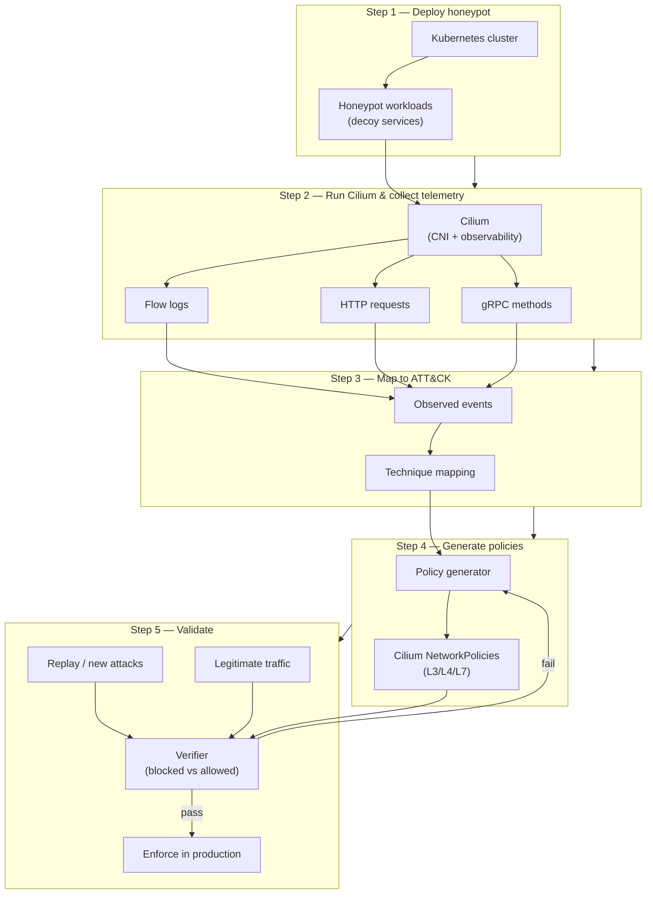

# Cloud Honeypot — Cilium Policy Pipeline

Deploy a Kubernetes honeypot, observe attacker behavior with Cilium, map activity to MITRE ATT&CK, auto-generate network policies, and validate that blocking works without breaking legitimate traffic.

---

## Pipeline overview



---

## Step 1 — Deploy a Kubernetes honeypot

- Provision a Kubernetes cluster (cloud or lab).
- Deploy decoy workloads that mimic real services (web apps, APIs, admin panels).
- Expose selected endpoints to attract scanner and exploit traffic.
- Keep honeypot namespaces isolated from production workloads.

---

## Step 2 — Run Cilium

Install and configure Cilium as the cluster CNI and observability layer.

**Collect:**

| Signal | Source | Use |
| --- | --- | --- |
| Flow logs | Hubble / Cilium flow exporter | L3/L4 connections, pod-to-pod and ingress/egress |
| HTTP requests | Cilium L7 visibility | Method, path, headers, status |
| gRPC methods | Cilium L7 visibility | Service, method, metadata |

Enable Hubble UI or export flows to a collector for downstream ATT&CK mapping and policy generation.

---

## Step 3 — Map observed actions to ATT&CK techniques

Correlate telemetry from Step 2 with [MITRE ATT&CK](https://attack.mitre.org/) techniques to label attacker behavior.

| Observed event | ATT&CK |
| --- | --- |
| `POST /login` brute force | [T1110](https://attack.mitre.org/techniques/T1110/) — Brute Force |
| `GET /secrets` | [T1552](https://attack.mitre.org/techniques/T1552/) — Unsecured Credentials |
| Upload reverse shell | [T1059](https://attack.mitre.org/techniques/T1059/) — Command and Scripting Interpreter |

Extend the mapping table as new attack patterns appear in honeypot telemetry.

---

## Step 4 — Automatically generate Cilium policies

Translate high-confidence ATT&CK-labeled events into enforceable Cilium policies (NetworkPolicy, CiliumNetworkPolicy, or CiliumClusterwideNetworkPolicy).

**Example — deny abusive HTTP paths:**

```yaml
apiVersion: cilium.io/v2
kind: CiliumNetworkPolicy
metadata:
  name: deny-admin-bruteforce
  namespace: honeypot
spec:
  endpointSelector:
    matchLabels:
      app: decoy-web
  ingress:
    - fromEntities:
        - world
      toPorts:
        - ports:
            - port: "8080"
              protocol: TCP
          rules:
            http:
              - method: POST
                path: /admin/*
                action: DENY
              - method: GET
                path: /secrets
                action: DENY
```

Policy generation should be driven by observed events (method, path, gRPC full method name, source labels) rather than hand-written rules for every attack variant.

---

## Step 5 — Test generated policies

Before promoting policies beyond the honeypot:

1. **Attack replay** — Re-run captured or synthetic attack traffic; confirm matching flows are denied and logged.
2. **Legitimate traffic** — Run baseline health checks, CI smoke tests, and known-good API calls; confirm they still succeed.
3. **Feedback loop** — If legitimate traffic is blocked or attacks still succeed, refine mappings (Step 3) and policy templates (Step 4), then re-test.

Success criteria: attacks mapped in Step 3 are blocked; legitimate traffic error rate stays within acceptable bounds.
