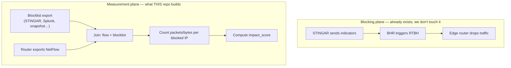

# QoB Code Review — Peer Walkthrough

**For:** teammates with little networking / security background  
**Goal:** understand what this project does, how the code is organized, and what to look at when we walk through it together.

---

## Start here: what problem are we solving?

Imagine a honeypot (Cowrie) that pretends to be a vulnerable server. Attackers try to log in. When we spot a bad IP, we **block** it so it cannot reach our real network.

**Quality of Blocking (QoB)** answers a follow-up question:

> *When we block someone, how much of their traffic did we actually stop?*

That matters because:

- Not every block is equally important — blocking an IP that sent 2 packets is different from one that sent 2 million.
- We want to **rank** blocked IPs by real impact, not just “on the list or not.”
- Later we’ll combine this with other signals (firewall logs, how long they’ve been blocked, etc.) into a fuller **attack severity** score.

**Important:** this project does **not** change how blocking works. It only **measures** what already happened. Think of it as a speedometer added next to the brakes — the brakes still work the same way.

---

## Vocabulary cheat sheet

You don’t need to be a network engineer to follow along. Here’s a mini glossary:


| Term                    | Plain English                                                                                                                                                 |
| ----------------------- | ------------------------------------------------------------------------------------------------------------------------------------------------------------- |
| **IP / source IP**      | The attacker’s address on the internet (like a return address on mail).                                                                                       |
| **RTBH**                | *Remotely Triggered Black Hole* — we tell routers “drop all traffic from this IP.”                                                                            |
| **Black-hole router**   | A router that throws away (drops) traffic matching the block, instead of forwarding it.                                                                       |
| **BHR**                 | **B**lack **H**ole **R**outer — the system that receives blocks from STINGAR and triggers **RTBH** on edge routers (SDN API in prod; ExaBGP in the lab).      |
| **Blocklist / publist** | A CSV or JSON export of *who is blocked, when, and why* — the **join key** for QoB. Same column shape whether it comes from STINGAR, a snapshot, Splunk, etc. |
| **indicator_id**        | An ID tying a block back to the honeypot detection (Cowrie/STINGAR lineage).                                                                                  |
| **NetFlow**             | Routers export summaries of traffic they saw (“IP A talked to IP B, N packets, M bytes”). Not full packet capture — more like a receipt.                      |
| **Sampling**            | Routers often only record 1 out of every N packets (e.g. 1 in 1000) to save cost. We **multiply back** by N to estimate totals.                               |
| **goflow2**             | Open-source tool that decodes NetFlow into JSON.                                                                                                              |
| **Redis**               | Fast in-memory database we use to store **counts** (not raw flows) with automatic expiry.                                                                     |


### BHR vs the blocklist (easy to mix up)

**BHR** = **Black Hole Router**. Its job in the blocking pipeline is **enforcement**: STINGAR sends it indicators, and BHR triggers RTBH so edge routers drop attacker traffic.

**QoB also needs a blocklist** — a file that says which IPs are blocked and when. That is a separate input from NetFlow. We join the two:

```
blocklist (who is blocked?)  +  NetFlow (how much traffic?)  →  QoB counts
```

Where the blocklist file actually comes from depends on the deployment. It might be a STINGAR export, a Splunk saved search, a one-off CSV from neteng, or a captured `publist.csv` snapshot. The code loads whatever path you give it via `qob/ingest/bhr_list.py` (the module name is historical — it expects the **publist column shape**, not necessarily a feed literally published by BHR).

**Ignore the phrase “BHR blocked-IP list.”** You may see it in older plan docs. It is not a special BHR product feature — it just means *a blocked-IP CSV in the shape this parser expects*. The test file `tests/fixtures/publist.csv` **is** the blocklist for demos; the lab uses `lab/consumer/blocklist.csv` the same way.

For tomorrow: **blocklist** = the input file to `bhr_list.load_blocklist()`. **BHR** = the RTBH enforcement step. Two different things.

---

## The big picture (two planes)




**Blocking plane:** detect → block → drop.  
**Measurement plane:** watch dropped (or seen-then-dropped) traffic → count it → score it.

We use **source-based** blocking: the attacker is the **source** IP in flow records (`src_addr`), not the destination.

---

## What “Part 1” does today

The README splits the work into parts:


| Part       | What it measures                                              | Status in code  |
| ---------- | ------------------------------------------------------------- | --------------- |
| **Part 1** | Traffic sunk at the black-hole router (`bh_hits`, `bh_bytes`) | **Implemented** |
| **Part 2** | Firewall “deny” logs (confirms block at the edge)             | Planned         |
| Later      | Honeypot sessions, time on list, penalties                    | Planned         |


**Today’s score formula** (in `qob/scoring.py`):

```
impact_score = (weight_hits × bh_hits) + (weight_bytes × log(1 + bh_bytes))
```

Why `log` on bytes? So one huge transfer doesn’t dominate the ranking. Hits and bytes both matter, but bytes are **capped** in influence.

---

## How data flows through the code (step by step)

This is the story to tell when you open the repo.

### Step 1 — Load the blocklist

**File:** `qob/ingest/bhr_list.py` (name is historical — read “blocked-IP list loader”)  
**Models:** `qob/models.py` → `BlockEntry`

**What is the “blocklist”?** Just a spreadsheet-style export of blocked IPs. Each row is one block. QoB asks: *“Was this flow’s source IP on the list at this time?”* If yes, count it.

You pass a path on the command line (`--blocklist tests/fixtures/publist.csv`). Where that file comes from in production is an ops question (STINGAR, Splunk, a snapshot from neteng) — the code only cares about the column shape.

Example rows:

```csv
cidr,indicator_id,source,why,added,removed,ident
185.12.34.56/32,ind-0001,CHN,SSH brute force,2026-06-10T00:00:00Z,2026-06-11T00:00:00Z,exabgp
```

Each row becomes a `BlockEntry`:

- **Which IP or subnet** is blocked (`cidr`)
- **When** the block is active (`added` / `removed`)
- **Which detection** caused it (`indicator_id`)

The blocklist is the **join key** — without it we don’t know which flows count as “blocked traffic.”

### Step 2 — Load flow records

**File:** `qob/ingest/flow_counters.py`  
**Models:** `qob/models.py` → `FlowRecord`

A flow is one summarized conversation: who talked to whom, how many packets/bytes, when, and at what sampling rate.

Example from `tests/fixtures/flows.csv`:

```csv
start,end,src,dst,src_port,dst_port,proto,packets,bytes,sampling_rate,device
2026-06-10T00:05:00Z,...,185.12.34.56,10.0.0.5,44321,22,TCP,5,300,1000,rtr1
```

`sampling_rate=1000` means “we only saw 1 in 1000 packets” → we multiply counts by 1000 to estimate reality.

We can ingest flows from:

- **CSV** — tests and offline replays
- **goflow2 JSON** — lab and planned production path
- **Elasticsearch** — optional path if flows already live in ElastiFlow

### Step 3 — Join flows to blocks (the heart of the project)

**File:** `qob/join_flows.py`

For **each flow**:

1. Is `src_addr` on the blocklist **at the time the flow started**?
2. If yes, add its packets/bytes (scaled by sampling) into a **time bucket** for that IP.
3. Attach the `indicator_id` from the matching block.

Helper pieces:

- `**BlockedSet`** — fast lookup: “is this IP blocked right now?”
- `**dedupe_flows**` — if two routers saw the same flow (common with redundant paths), count it once.
- `**align_window**` — snap timestamps into fixed windows (e.g. 5 minutes or 1 day).

Output: a list of `**ImpactCount**` objects — one per (IP, time window) with `bh_hits`, `bh_bytes`, etc.

### Step 4 — Score it

**File:** `qob/scoring.py`

Takes each `ImpactCount` and returns a single `impact_score` float. Simple on purpose for v1.

### Step 5 — Store or print results

Three ways to run the pipeline:


| Path              | Entry point                | Best for                              |
| ----------------- | -------------------------- | ------------------------------------- |
| **CLI / CSV**     | `jobs/compute_qob.py`      | Demos, tests, one-off analysis        |
| **Redis**         | `qob/ingest/flow_redis.py` | Production-style rolling 7-day counts |
| **Elasticsearch** | `qob/ingest/flow_es.py`    | If you already store flows in ES      |


**Quick demo command** (no infra needed):

```bash
python -m jobs.compute_qob --source csv \
  --blocklist tests/fixtures/publist.csv \
  --flows tests/fixtures/flows.csv \
  --window 3600
```

This prints one JSON line per (IP, window) with counts and `impact_score`.

---

## Folder map (what lives where)

```
quality-of-blocking/
├── README.md                 # Project overview & status table
├── code_review.md            # This document
├── qob/                      # Core library (the important part)
│   ├── models.py             # Data types: FlowRecord, BlockEntry, ImpactCount
│   ├── join_flows.py         # Join logic (correlate flows ↔ blocks)
│   ├── scoring.py            # impact_score formula
│   └── ingest/
│       ├── bhr_list.py       # Load blocklist CSV/JSON
│       ├── flow_counters.py  # Parse flows (CSV, goflow2)
│       ├── flow_redis.py     # Write/read counts in Redis
│       └── flow_es.py        # Aggregate via Elasticsearch (optional)
├── jobs/
│   └── compute_qob.py        # Command-line tool tying it all together
├── tests/                    # Pytest — good examples of expected behavior
│   └── fixtures/             # Tiny fake blocklist + flows
├── lab/                      # Mini network in Docker (containerlab)
│   ├── consumer/run.py       # Tails goflow2 → Redis (like production)
│   └── test/run_ab_test.sh   # Sends traffic, blocks IP, checks counts
├── collectors/
│   └── poll_flows.py         # Stub — future scheduled production poller
└── plan-*.md                 # Design docs (more detail than you need for v1)
```

**Rule of thumb:** if you only read four files, read `models.py`, `join_flows.py`, `scoring.py`, and `jobs/compute_qob.py`.

---

## Walk through the test fixtures together

The tests are the easiest way to see “correct” behavior without running the lab.

### Blocklist (`tests/fixtures/publist.csv`)


| IP              | Block period              | Notes                                 |
| --------------- | ------------------------- | ------------------------------------- |
| `185.12.34.56`  | 24 hours                  | Normal case, multiple flows           |
| `203.0.113.50`  | Open-ended (no `removed`) | Still blocked                         |
| `198.51.100.10` | 02:00–06:00 UTC           | Flow after 06:00 should **not** count |


### Flows (`tests/fixtures/x`flows.csv`)

- Two identical flows from `rtr1` and `rtr2` → **deduped** to one
- `8.8.8.8` → not on blocklist → **ignored**
- `198.51.100.10` at 07:00 → block expired → **ignored**

### Expected math (one example)

For `185.12.34.56` in the first hour:

- Raw packets: 5 + 3 = 8 (duplicate router row dropped)
- Sampling rate: 1000
- **bh_hits** = 8 × 1000 = **8000**

Tests live in `tests/test_join.py`, `tests/test_scoring.py`, `tests/test_flow_redis.py`, `tests/test_flow_es.py`.

Run them:

```bash
pip install -e '.[dev]'
pytest tests/ -q
```

---

## The lab (optional live demo)

If you have time tomorrow, the `lab/` folder is a **toy network** that proves the pipeline end-to-end:

```
attacker container → router (drops when blocked) → victim container
                         ↓ NetFlow
                    goflow2 → Python consumer → Redis
```

- **ExaBGP** pretends to be the system that tells the router “block this IP.”
- **Redis** holds `qob:hits:IP:YYYYMMDD` counters with ~7-day TTL.
- `**lab/test/verify.py`** reads counts back and prints `impact_score`.

You do **not** need to run the lab for the code review — the unit tests already exercise the same Python logic. The lab adds: “real NetFlow bytes actually move through the pipeline.”

See `lab/README.md` for setup (Linux VM + containerlab).

---

## Design choices worth explaining to peers

### 1. Why correlate in Python instead of only in the database?

For CSV and Redis paths we join in Python with clear, testable logic (`correlate()`). For Elasticsearch we push **aggregation** into ES (sum packets per IP per window) because millions of flows won’t fit in memory.

### 2. Why Redis for production counts?

- We only need **totals per IP per day** for ~7 days — not every raw flow forever.
- Keys auto-expire (TTL) — no manual cleanup.
- Keeps heavy flow traffic off the Elasticsearch cluster used elsewhere.

### 3. Why accept sampled NetFlow for v1?

Exact per-IP drop counters often don’t exist on black-hole (`Null0`) interfaces. Sampled NetFlow is good enough to **rank** which blocks matter most, even if absolute numbers are estimates. We tag rows with `accuracy: estimated_sampled` so we know.

### 4. Why `indicator_id`?

The blocklist mixes honeypot blocks and other sources. QoB is meant to score **honeypot-sourced** blocks; `indicator_id` is how we trace back to the original detection.

### 5. Zero dependencies in the core library

`qob/` uses only Python’s standard library. Optional extras: `redis`, `elasticsearch`, `pytest`. That keeps tests fast and deployment simple.

---

## What is NOT built yet (so nobody expects it)


| Item                                       | Where                      | Status                     |
| ------------------------------------------ | -------------------------- | -------------------------- |
| Scheduled production poller                | `collectors/poll_flows.py` | `NotImplementedError` stub |
| Firewall deny confirmation                 | `plan-fw-denies.md`        | Designed, not coded        |
| Full QoB rank with penalties / persistence | README “Add vs mark” table | Future                     |
| Live BHR API polling                       | `bhr_list.py` comments     | Reads local files only     |


---

## Known limitations (honest talking points)

1. **ES path doesn’t dedupe multi-router duplicates** — documented in `flow_es.py`; CSV/Redis in-batch dedupe handles it for the other paths.
2. **Window defaults differ** — CLI often uses 300s windows; Redis/lab uses 86400s (daily buckets). Intentional but easy to confuse.
3. **First matching block wins** — if two block entries overlap the same IP, we take the first match for `indicator_id`.
4. **Lab uses softflowd (pcap)** — proves the pipeline, not necessarily the exact accounting order on Cisco ASICs.

---

## Suggested agenda for tomorrow (~45–60 min)


| Time   | Topic                          | What to open                                    |
| ------ | ------------------------------ | ----------------------------------------------- |
| 5 min  | Problem statement & vocabulary | This doc, README                                |
| 10 min | Data model                     | `qob/models.py`                                 |
| 15 min | Join algorithm                 | `qob/join_flows.py` + `tests/test_join.py`      |
| 5 min  | Scoring                        | `qob/scoring.py`                                |
| 10 min | Running the CLI                | `jobs/compute_qob.py`, run demo command         |
| 10 min | Storage paths                  | Skim `flow_redis.py` OR `flow_es.py` (pick one) |
| 5 min  | What’s next / Q&A              | README status table, `plan-fw-denies.md`        |


---

## Questions peers might ask (and short answers)

**Q: Is this blocking attackers?**  
A: No. Blocking already happens upstream. We only count and score.

**Q: What is BHR?**  
A: **Black Hole Router** — the part of the stack that triggers RTBH so edge routers drop blocked sources. It is **not** the same thing as the blocklist file QoB reads; that export may come from STINGAR, Splunk, or a snapshot (`bhr_list.py` just parses the CSV/JSON shape).

**Q: Why log bytes?**  
A: So one massive transfer doesn’t swamp the score; we still care about bytes, just with diminishing returns.

**Q: Can counts be wrong?**  
A: Yes — sampling estimates, duplicate routers (we dedupe when we can), and lab vs production hardware differ. We track `accuracy` and `sampling_rate` for transparency.

**Q: What’s the output?**  
A: Per IP, per time window: `bh_hits`, `bh_bytes`, `indicator_id`, `impact_score`. In production, also Redis keys and a daily ranking sorted set.

**Q: What should I review critically?**  
A: The join logic in `join_flows.py`, test coverage in `tests/`, and whether the scoring formula matches what we want politically (“what counts as a good block?”).

---

## One-sentence summary

**QoB joins router flow logs with the official blocklist to estimate how much traffic we stopped per blocked IP, then ranks them with a simple score — without changing how blocking works.**

Good luck tomorrow.