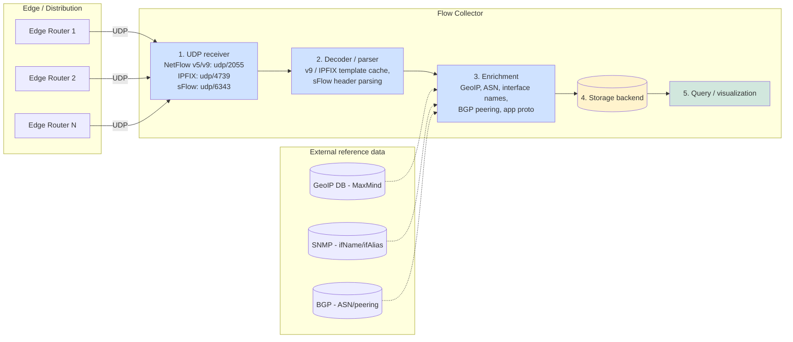
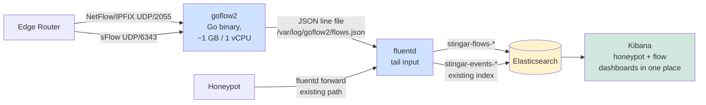

Flow Collector Research: Akvorado, ElastiFlow, nfdump, Kentik, goflow2

**Default platform-agnostic question:** When an edge router exports NetFlow / IPFIX / sFlow telemetry, what receives it, decodes it, stores it, and lets an operator query it? This document surveys the widely-deployed options and answers the "does it require dedicated hardware?" question.

**Scope:** This document is the consumption-side companion to [`blackhole_logging_report.md`](blackhole_logging_report.md) and to the BGP-RTBH feed roadmap candidate in [Section 9 of the main roadmap](roadmap.md). Where the blackhole report covers "how do I make the router drop traffic and emit telemetry about it," this report covers "what do I point the telemetry at, and what does that cost?" For an end-to-end edge-router-to-STINGAR configuration walkthrough (Cisco IOS-XE default, with full subsections for Juniper, Arista, MikroTik, HPE Aruba) that operationalizes the recommendation below, see [`edge_router_netflow_integration.md`](edge_router_netflow_integration.md).

**Context for STINGAR operators:** STINGAR's v2.4+ BGP-RTBH feed candidate produces blocklist data that customers can feed into their edge routers. Once those routers are blackholing attacker traffic, customers will want visibility into what got dropped -- which means flow telemetry, which means a flow collector. This document identifies the realistic deployment options (including a STINGAR-native one using the existing `stingar-efk` stack) so the feature can ship with documented end-to-end architecture.

## Revisions

| Date | Change |
|---|---|
| 2026-06-02 | Initial publication. Recommended a fluentd-plugin-native STINGAR path using [`fluent-plugin-netflow`](https://rubygems.org/gems/fluent-plugin-netflow). |
| 2026-06-03 | **Recommendation revised.** Discovered during follow-up research that `fluent-plugin-netflow` is effectively abandoned: last release v1.1.0 was 2022-06-05, no GitHub commits since, 11 open issues unaddressed, and operators on [fluent-bit issue #4806](https://github.com/fluent/fluent-bit/issues/4806) explicitly report unsustainable CPU at production rates ("soon the CPU usage went high due to high rate of received flows... I went to custom code in go to speedup the collector"). Also confirmed that Fluent Bit has no native NetFlow input (open since 2022) and Vector has no dedicated NetFlow source. The corrected recommendation introduces **[goflow2](https://pkg.go.dev/github.com/netsampler/goflow2/v3)** -- a pure-Go specialized collector, actively maintained (latest commit 2026-05-28) -- as a sidecar in `stingar-efk`. fluentd tails goflow2's JSON output; honeypot events keep flowing through their existing path. See the "STINGAR-native option" and "Recommendation" sections below for the updated design. |

---

## How a flow collector works -- the universal architecture

Every flow collector ingests the same UDP-delivered telemetry from routers and produces a queryable history of flows. The internals follow the same five stages regardless of product:

The five stages, what they do, and why each one matters:

1. **UDP receiver** -- listens on the well-known flow ports. Cheap and dumb; just dequeues datagrams as fast as the kernel can deliver them. Loss here is irrecoverable (UDP), so sizing the receive buffer (`net.core.rmem_max`) and the worker pool matters.
2. **Decoder** -- turns raw bytes into typed flow records. NetFlow v9 and IPFIX are template-driven: the router periodically sends a template record describing the shape of subsequent data records. The decoder maintains a per-source template cache. sFlow is simpler (self-describing) but lossier (sampled, not flow-summarized).
3. **Enrichment** -- adds context the router did not include: GeoIP country/ASN from MaxMind, interface names from SNMP polling (because the router only sends `ifIndex` numbers), peering relationships from BGP, sometimes application-protocol classification (HTTPS vs SSH from port + cert hints). This is where the four products differ most.
4. **Storage** -- write-heavy time-series. The choice of backend is the single biggest architectural decision: ClickHouse (columnar SQL, very fast aggregations), Elasticsearch (inverted index, good for ad-hoc queries), flat binary files (simplest, hardest to query), or a vendor cloud DB.
5. **Query / visualization** -- the dashboarding layer. Almost always Grafana, Kibana, or the vendor's own web app.

---

## The four products mapped to that abstraction

| Stage | Akvorado | ElastiFlow | nfdump | Kentik |
|---|---|---|---|---|
| Receiver + decoder | `akvorado inlet` (Go) | `flowcoll` (Go) | `nfcapd` daemon (C) | `kproxy` agent (Go) |
| Protocols | NetFlow v5/v9, IPFIX, sFlow | NetFlow v5/v9, IPFIX, sFlow | NetFlow v5/v9, IPFIX (sFlow via `sfcapd`) | NetFlow v5/v9, IPFIX, sFlow, JFlow, plus BGP, BMP, streaming telemetry |
| Enrichment | GeoIP, ASN, SNMP (`gosnmp`), BGP via internal session | GeoIP, ASN, DNS reverse, BGP, app proto (paid tier) | None built-in; bring-your-own scripts | Extensive: BGP, peering analytics, DDoS/anomaly detection, automated peering recommendations |
| Storage | **ClickHouse** | **Elasticsearch** | Flat compressed binary files on disk | **Kentik cloud** (proprietary TSDB) |
| Visualization | Built-in web UI + Grafana datasource | Kibana with prebuilt ElastiFlow dashboards | `nfsen` web UI (legacy) or CLI (`nfdump`) | Kentik web app |
| License | Open source (AGPLv3) | Open core: free tier (Elastic v2 license) + paid enterprise | Open source (BSD) | Commercial SaaS only |
| Deployment | Docker compose; all-in-one or split | Docker / k8s; bring your own Elastic | Any Linux box; tiny footprint | `kproxy` on-prem, everything else SaaS |
| Best for | ISPs / large nets wanting modern UI without paying | Orgs already running Elastic stack | Scripted forensics, lightweight ops, raw-file archival | Tier-1 ISPs, cloud providers, large enterprises OK with SaaS |

Worth being explicit about the design philosophies, since they are not just feature differences:

- **Akvorado** is the **modern open-source production answer**. ClickHouse-backed, built specifically for ISP / network-engineering use cases (peering analysis, traffic engineering). It is what Free.fr / Renater run for their own networks and open-sourced. Sweet spot: 1-10 edge routers, 10K-1M flows/sec. Sizing claims should be re-verified against the project's current `docs/` before committing to a deployment plan.
- **ElastiFlow** is the **"use what you already have"** answer. If you are already running an EFK stack (STINGAR is), it slots in. Free tier is fully functional; the paid tier adds vendor support, more enrichment, and HA features.
- **nfdump** is the **"keep it simple, keep it scriptable"** answer. No database, no daemon mesh, just files on disk that you `grep`-equivalent through with the `nfdump` CLI. Sometimes the right answer for "I just need a record of what went through last week."
- **Kentik** is the **fully managed answer for orgs that do not want to operate any of this**. You hand them your flows and they hand you a finished product. Pricing typically starts in the $40-100k/yr range -- overkill for most STINGAR customers but the right answer at carrier scale.

---

## A fifth option, different in kind: goflow2 (specialized collector, bring-your-own storage)

The four products above are **complete platforms** -- they ship collector + storage + UI as one bundle. There is a fifth open-source project that is intentionally just the receiver + decoder + enricher, leaving storage and visualization to whatever pipeline you already have:

| Stage | goflow2 ([`netsampler/goflow2`](https://pkg.go.dev/github.com/netsampler/goflow2/v3)) |
|---|---|
| Receiver + decoder | Single Go binary; `goflow2 -listen 'netflow://:2055,sflow://:6343'` |
| Protocols | NetFlow v5, NetFlow v9, IPFIX, sFlow v5 |
| Enrichment | Minimal -- emits decoded fields only. Bring your own GeoIP / ASN enrichment in the downstream pipeline. |
| Storage | **None bundled.** Outputs JSON to stdout, files (with SIGHUP rotation), or Kafka. Pair with any sink. |
| Visualization | None bundled. Use Kibana / Grafana / whatever queries your sink. |
| License | BSD-3 |
| Deployment | Single binary; Docker image; ~10 MB resident. Easily a sidecar in an existing stack. |
| Maintenance | **Actively maintained** -- latest v3 commit 2026-05-28; weekly to monthly commits over the last 12 months. |
| Best for | Operators who already have a logging / metrics pipeline and want to add flow ingest without standing up a second platform. **This is STINGAR's right answer.** |

goflow2 fills the gap that the abandoned `fluent-plugin-netflow` left: a fast, maintained, NetFlow / IPFIX / sFlow decoder that hands you structured records and stays out of your way. It is what the broader community has converged on for "I just need the UDP-to-JSON part" since fluent-bit and Vector both declined to add native NetFlow support.

The Elastic project ships an [official goflow2 integration](https://www.elastic.co/docs/reference/integrations/goflow2) that normalizes goflow2's sFlow output to ECS schema (NetFlow / IPFIX normalization is not yet upstream). For STINGAR's purposes we will write our own fluentd parser + ES mapping anyway (matching the pattern we already use for honeypot events), so the limitation is moot.

The goflow2 repo also ships [`compose/elk`](https://github.com/netsampler/goflow2/tree/main/compose/elk) and [`compose/kcg`](https://github.com/netsampler/goflow2/tree/main/compose/kcg) reference docker-compose stacks for "ELK" and "Kafka + ClickHouse + Grafana" respectively. The ELK example is a useful reference when wiring goflow2 into STINGAR's existing Elasticsearch.

---

## Hardware vs software -- the actual answer

**All four are software. None require dedicated hardware.** That said, "software running on a VM" does not mean the sizing is trivial -- flow collection is genuinely write-heavy and the storage layer dominates the budget. Approximate ballparks (verify against current vendor docs before committing):

| Deployment size | Edge routers | Sustained flows/sec | Per-router export rate (NetFlow v9, 1:1000 sampling) | Sized as |
|---|---|---|---|---|
| Tiny (lab, single-site SMB) | 1 | ~1-10K | ~10-100 KB/s | 2 vCPU / 4 GB RAM / 100 GB SSD VM. Any of Akvorado/ElastiFlow/nfdump fits. |
| Small (university campus, mid-size enterprise) | 3-10 | ~50-200K | ~1-2 MB/s aggregate | 4-8 vCPU / 16-32 GB RAM / 500 GB-1 TB SSD VM. Same options. |
| Medium (regional ISP, large multi-site enterprise) | 10-50 | ~500K-2M | ~10-50 MB/s aggregate | 8-16 vCPU / 64-128 GB RAM / 2-10 TB SSD; ClickHouse/ES starts paying off. Akvorado or ElastiFlow paid. |
| Large (Tier-2 / Tier-3 ISP, large cloud provider) | 50-500 | 2M-10M+ | hundreds of MB/s | Clustered storage (ClickHouse shards or ES hot/warm tiers), multiple collector frontends behind a load balancer. Kentik or Akvorado at scale. |

Two caveats that bite operators new to flow collection:

- **Sampling rate is the lever you actually have.** Routers can sample 1:1, 1:1000, 1:100000 -- most ISPs run 1:1000 or 1:10000. Lower sampling = more flow records = more storage. The numbers above assume 1:1000. Bumping to 1:100 (10x more flows) multiplies your storage requirement proportionally. Bumping to 1:1 (no sampling) is rarely sustainable above ~1 Gbps of underlying traffic.
- **Retention dominates disk.** A flow record is ~250-400 bytes after enrichment, indexed. At 100K flows/sec sustained that is ~10-20 GB/day before compression -- call it 1-3 TB/month. Most ops teams want 30-90 days of hot retention, which is where the disk bill comes from. ClickHouse compresses very well (often 10x); Elasticsearch with proper rollups is decent; nfdump's flat files compress to ~30%.

The "do I need hardware?" question really translates to "do I need enough disk and IOPS?" -- and that scales smoothly with a software deployment. There is no flow-collector hardware appliance product worth recommending in 2026; the era of those (Network General, Riverbed Cascade, etc.) ended when commodity x86 + SSDs got cheap and fast enough to outpace ASIC-based capture boxes for this workload.

---

## STINGAR-native option: goflow2 sidecar in the existing stack (REVISED 2026-06-03)

The architecturally cleanest answer for STINGAR customers is: **add a single goflow2 container to the `stingar-efk` stack and have the existing fluentd tail its JSON output**. Honeypot events keep flowing through their existing path unchanged. Flow records land in a new `stingar-flows-*` Elasticsearch index alongside the existing `stingar-events-*` honeypot index, queryable from the same Kibana.

> **Why this design, not the previous fluent-plugin-netflow design:** the original 2026-06-02 version of this document recommended `fluent-plugin-netflow` inside the central fluentd. Follow-up research determined that plugin is effectively abandoned (no commits since 2022, known unsustainable CPU at production rates) and that fluent-bit / Vector both lack native NetFlow input. goflow2 is the actively-maintained Go-based alternative and is what the broader community has converged on. See the "Revisions" section at the top of this document for the full discovery.

Trade-offs vs the four full-platform options (Akvorado / ElastiFlow / nfdump / Kentik):

- **Pro:** one container added to a stack STINGAR already operates. No second TSDB, no second UI, no second set of credentials. Honeypot events and edge-router blackhole drops appear in the same Kibana, indexable by the same fields (`src_ip`, `dst_ip`, etc.), correlatable by source-IP join across `stingar-events-*` and `stingar-flows-*`.
- **Pro:** the Go decode path is fast. goflow2 has been demonstrated by community deployments to handle hundreds of thousands of flows/sec on a single core; STINGAR's typical customer is two orders of magnitude below that.
- **Pro:** the project is actively maintained (latest commit 2026-05-28) and has a stable v2 API and a v3 in active development.
- **Con:** less enrichment than Akvorado's built-ins (peering analysis, top talkers per peer, AS-path inference). For "did the firewall / router drop this attacker IP that STINGAR told it to" the basic decoded fields are enough; for richer network-engineering analytics you would still want Akvorado.
- **Con:** an additional ~10 MB container in the stack. Trivial cost.

For the concrete configuration (Cisco IOS-XE side as the default, plus Juniper / Arista / MikroTik / Aruba subsections + goflow2 docker-compose stanza + fluentd source config + per-vendor validation steps), see [`edge_router_netflow_integration.md`](edge_router_netflow_integration.md).

ElastiFlow remains the right answer if a customer wants the prebuilt network-traffic dashboards without writing them. Akvorado becomes right if they want ClickHouse's analytics power. Kentik becomes right if they want someone else to operate it. goflow2-as-sidecar is the right STINGAR default.

---

## Recommendation for the BGP-RTBH feed roadmap entry

The BGP-RTBH feed candidate in [`roadmap.md` Section 9](roadmap.md) points at `blackhole_logging_report.md` for "consumption-side architecture, vendor commands, and flow-collector requirements." When that v2.4+ feature is actually scoped, the consumption story should default to:

1. **Documented default path:** STINGAR emits the BGP-RTBH feed; customer's edge router blackholes attacker IPs; customer's `stingar-efk` stack (extended with a single **goflow2 sidecar container**) ingests NetFlow / IPFIX / sFlow from the edge router; existing fluentd tails goflow2's JSON output into a new `stingar-flows-*` Elasticsearch index; Kibana dashboards filter on `out_if_name: Null0` (or `is_blackhole: true` after a fluentd record-transformer step) for blackhole-specific drops. End-to-end walkthrough lives in [`edge_router_netflow_integration.md`](edge_router_netflow_integration.md).
2. **Optional power-user path:** customers who want richer network-engineering analytics can point their routers at Akvorado or ElastiFlow alongside STINGAR; the BGP feed exporter does not care what is downstream. goflow2 also supports forwarding to Kafka so a future "tee to both STINGAR ES and an operator's existing collector" path stays open.

That keeps the feature self-contained (no required external dependencies beyond what STINGAR already ships) while leaving the door open for power users.

---

## Open questions / followups before committing the BGP-RTBH feature

The 2026-06-02 version of this list included several questions about `fluent-plugin-netflow` that are now moot. The revised list:

- **Benchmark the goflow2 path against a realistic STINGAR customer's edge-router flow rate.** goflow2 is known to handle hundreds of K flows/sec on commodity hardware; needs concrete confirmation against STINGAR's typical 2-vCPU / 4 GB VM profile before promising specific numbers in customer docs.
- **Decide whether to ship the goflow2 container as a default service in `stingar-efk`** (always running, idle if no flow exporters configured) or as an opt-in `docker compose --profile flows up` service activated only when the customer enables flow ingest. Default-on is simpler for users; opt-in keeps the surface minimal for customers who do not need it. Probably opt-in, given that flow ingest only matters once the BGP-RTBH feature also ships.
- **fluentd record-transformer cost.** The Ruby record_transformer that normalizes goflow2 fields to STINGAR's mapping ran fine in chat for the example shown -- need to validate it does not become the bottleneck at high flow rates (the goflow2 Go decode is fast; the fluentd post-processing in Ruby is the new candidate hot spot).
- **Sample / template Kibana dashboards for "blackhole drops" view.** Providing the saved-objects export for a Kibana dashboard that filters on `is_blackhole: true` + STINGAR's attacker-IP tagging is what makes the recommendation operational rather than theoretical. Same priority as before; just rebased on the new index name (`stingar-flows-*`) and field names (`out_if_name`, `is_blackhole`).
- **License compatibility.** goflow2 is BSD-3 (very permissive, no concerns about bundling). Akvorado remains AGPLv3 and ElastiFlow remains Elastic v2 -- both fine to reference as "compatible downstream consumers" without bundling.
- **fluent-plugin-netflow rehabilitation watch.** If the plugin gets a maintainer or is forked actively, revisit whether it becomes a reasonable lower-complexity alternative to the goflow2 sidecar. Low priority -- the goflow2 path is the more robust architecture regardless.

---

## Related STINGAR work

- [`blocking_and_blackhole_logging_report.md`](blocking_and_blackhole_logging_report.md) -- combined NGFW + edge-router blocking reference. Part 2 (Edge Router) sets up the upstream side of the pipeline this document covers.
- [`blackhole_logging_report.md`](blackhole_logging_report.md) -- standalone version of Part 2 of the combined report; focused on edge-router BHR/RTBH and what each platform emits as telemetry.
- [`roadmap.md` Section 9](roadmap.md) -- BGP-RTBH feed export candidate (v2.4+); this research informs the consumption-side documentation for that feature.
- [`Releases/RELEASE_NOTES_2.3.md`](../Releases/RELEASE_NOTES_2.3.md) -- IDS/IPS Rules feed endpoint shipped in v2.3 (`GET /api/v2/ids-rules/feed?format=suricata|snort`); the BGP-RTBH feed would live alongside it as a new output format.
- [`edge_router_netflow_integration.md`](edge_router_netflow_integration.md) -- end-to-end edge-router configuration walkthrough for the goflow2-as-sidecar architecture recommended in this document. Cisco IOS-XE is the recommended default, with full subsections for Juniper JunOS, Arista EOS, MikroTik RouterOS, and HPE Aruba CX, plus a brief reference table covering Cisco IOS-XR / NX-OS / Meraki, Huawei VRP, VyOS, pfSense / OPNsense, and Ubiquiti EdgeRouter. Includes the goflow2 service definition for `infra/docker/docker-compose.yml`, the fluentd source + record_transformer + Elasticsearch output config, host firewall rules, a per-vendor router-side validation commands table, and appendices on legacy-IOS fallbacks and customer-deployment sizing.
- The goflow2-as-sidecar ingest path described above terminates in the same `stingar-efk` stack already used for honeypot events. A customer who wires up edge-router flow export gets unified visibility across honeypot detections, NGFW drops, and edge-router blackholes in one Elasticsearch -- no second platform to operate.

