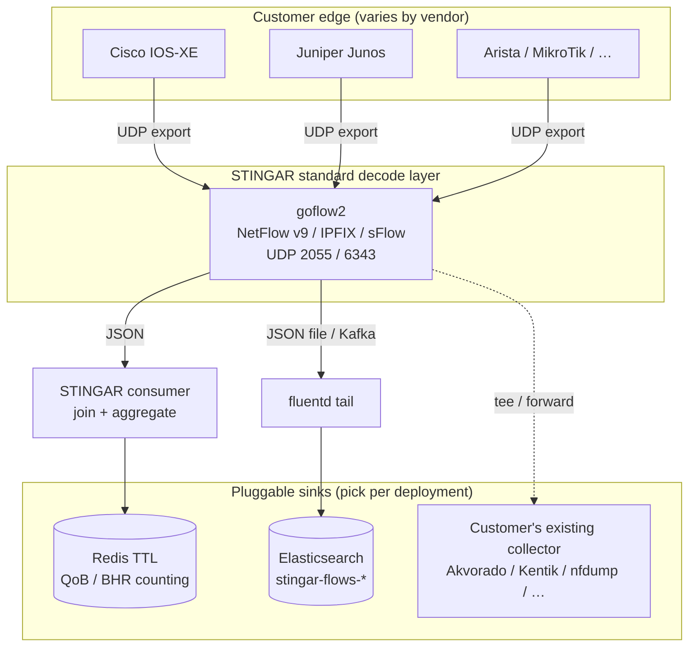
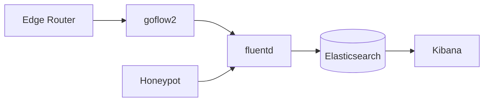
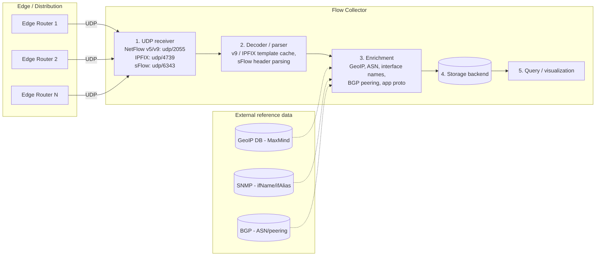

# Flow Collector Research: Akvorado, ElastiFlow, nfdump, Kentik, goflow2

**Default platform-agnostic question:** When an edge router exports NetFlow / IPFIX / sFlow telemetry, what receives it, decodes it, stores it, and lets an operator query it? This document surveys the widely-deployed options and answers the "does it require dedicated hardware?" question.

**Scope:** Consumption-side companion to [`black_hole_logging.md`](./black_hole_logging.md) (router-side telemetry) and [`black_hole_blocking.md`](./black_hole_blocking.md) (NGFW + edge-router logging). Where those documents cover *how to make the router drop traffic and what it emits*, this document covers *what to point telemetry at* and *how STINGAR should support different customer architectures*.

**Context for STINGAR:** Once customers blackhole attacker IPs (BGP-RTBH, BHR, or STINGAR blocklist feeds), they need visibility into what got dropped. That requires a flow collector. STINGAR standardizes on **goflow2** as the decode layer and supports **multiple downstream sinks** depending on what each deployment already runs.

---

## Revisions

| Date | Change |
| --- | --- |
| 2026-06-02 | Initial publication. Recommended `fluent-plugin-netflow` inside fluentd. |
| 2026-06-03 | **Recommendation revised.** `fluent-plugin-netflow` abandoned; **goflow2** as STINGAR sidecar decoder. Default sink: fluentd → Elasticsearch (`stingar-flows-*`). |
| 2026-06-17 | **Multi-architecture STINGAR model.** goflow2 remains the shared decoder; document **pluggable sinks**. **Redis aggregate-at-ingest** is the current QoB / BHR-counting path ([`plan-netflow-counting.md`](../plan-netflow-counting.md)); Elasticsearch remains the dashboard-oriented option for full `stingar-efk` deployments. Fixed in-repo cross-links. |

---

## STINGAR flow architecture (multi-customer)

STINGAR customers differ in what they already operate: some run the full `stingar-efk` stack with Kibana; others only need per-IP blocking-impact counters for QoB scoring. The decode step is the same; the **sink** is configurable.



### Deployment profiles

| Profile | Best for | Pipeline | Retention | Query UI |
| --- | --- | --- | --- | --- |
| **A — QoB / BHR counting (current default)** | Per-IP blocking impact score; short-lived counters; sites that already use Redis (e.g. hpfeeds-bhr) | goflow2 → **consumer** → **Redis** | ~7 days (per-key TTL) | RedisInsight, QoB API |
| **B — Full STINGAR EFK** | Operators who want honeypot + flow drill-down in one Kibana | goflow2 → fluentd → **Elasticsearch** | ILM policy (30–90d typical) | Kibana |
| **C — Bring-your-own collector** | Large nets with Akvorado/Kentik already deployed | Router → customer's collector; STINGAR blocklist feed unchanged | Customer-defined | Customer UI |
| **D — Forensics / replay** | Validation, neteng golden tests, CI | nfdump capture → CSV → offline correlator | Archive on disk | CLI / `compute_qob` |

**Router export is identical across profiles:** point NetFlow v9 / IPFIX / sFlow at the goflow2 listener (`<collector-ip>:2055` for NetFlow/IPFIX). Vendor-specific exporter config lives in [`edge_router.md`](./edge_router.md) and [`black_hole_logging.md`](./black_hole_logging.md).

### Profile A — Redis (implemented today)

This repo implements Profile A for **Quality of Blocking (QoB)** Part 1. Flow is a **measurement input only** — we need `src_ip`, packets, bytes, sampling, timestamp, not org-wide flow search. Aggregating at ingest keeps the firehose off Elasticsearch.

```text
Routers ──NetFlow/IPFIX/sFlow──▶ goflow2 ──JSON──▶ consumer ──▶ Redis (TTL ~7d)
                                      │              • join ⋈ BHR blocklist (src_ip)
                                      │              • scale by sampling_rate
                                      │              • qob:hits / qob:bytes / qob:rank
```

Implementation: [`qob/ingest/flow_redis.py`](../qob/ingest/flow_redis.py), [`lab/consumer/run.py`](../lab/consumer/run.py). Design detail: [`plan-netflow-counting.md`](../plan-netflow-counting.md) §3.1.

goflow2 example (matches the lab):

```bash
goflow2 -listen netflow://:2055 -format json -transport file \
  -transport.file /var/log/goflow2/flows.json
```

### Profile B — Elasticsearch (STINGAR EFK customers)

For customers who want unified honeypot + flow dashboards, add goflow2 as a sidecar in `stingar-efk`. fluentd tails goflow2's JSON into `stingar-flows-*` alongside `stingar-events-*`. Full fluentd source config, docker-compose stanzas, and per-vendor router steps: [`edge_router.md`](./edge_router.md).



Trade-off vs Profile A: richer ad-hoc queries and dashboards; higher storage and indexing cost. Suitable when flow retention beyond ~7 days or cross-index correlation in Kibana is required.

### Profile C — External collector

STINGAR's blocklist / BGP-RTBH feed does not depend on which collector receives flows. Customers may point exporters at Akvorado, ElastiFlow, Kentik, or nfdump while still using STINGAR for detection and blocking. QoB can optionally read from Elasticsearch if flows are already indexed ([`qob/ingest/flow_es.py`](../qob/ingest/flow_es.py), `compute_qob --source es`).

### Choosing a profile

| Customer situation | Recommended profile |
| --- | --- |
| QoB scoring, BHR impact counters, Redis already in stack | **A — Redis** |
| Full STINGAR deployment, analysts use Kibana daily | **B — Elasticsearch** |
| Existing NetOps platform (Kentik, Akvorado, etc.) | **C — External** (+ optional ES bridge for QoB) |
| Lab validation, neteng golden test, CI replay | **D — nfdump / CSV** |

Profiles are not mutually exclusive long-term (e.g. Kafka tee from goflow2 to both Redis consumer and fluentd), but **start with one sink** to avoid double-counting without dedupe guards.

---

## How a flow collector works — the universal architecture

Every flow collector ingests the same UDP-delivered telemetry from routers and produces a queryable history of flows. The internals follow the same five stages regardless of product:



The five stages:

1. **UDP receiver** — listens on well-known flow ports. Loss here is irrecoverable (UDP); size receive buffers and worker pools accordingly.
2. **Decoder** — template-driven for NetFlow v9 / IPFIX; self-describing for sFlow. **STINGAR standardizes this stage on goflow2.**
3. **Enrichment** — GeoIP, ASN, interface names, BGP context. goflow2 emits minimal fields; full platforms (Akvorado, ElastiFlow) add more upstream of storage.
4. **Storage** — Redis (aggregated counters), Elasticsearch, ClickHouse, flat files, or SaaS. **This is the main per-customer fork.**
5. **Query / visualization** — RedisInsight, Kibana, Grafana, vendor UI, or QoB scoring jobs.

---

## The four full-platform products mapped to that abstraction

| Stage | Akvorado | ElastiFlow | nfdump | Kentik |
| --- | --- | --- | --- | --- |
| Receiver + decoder | `akvorado inlet` (Go) | `flowcoll` (Go) | `nfcapd` (C) | `kproxy` (Go) |
| Protocols | NetFlow v5/v9, IPFIX, sFlow | NetFlow v5/v9, IPFIX, sFlow | NetFlow v5/v9, IPFIX | NetFlow, IPFIX, sFlow, JFlow, … |
| Enrichment | GeoIP, ASN, SNMP, BGP | GeoIP, ASN, DNS, BGP, app proto (paid) | None built-in | Extensive (SaaS) |
| Storage | **ClickHouse** | **Elasticsearch** | Flat files | **Kentik cloud** |
| Visualization | Web UI + Grafana | Kibana dashboards | `nfsen` / CLI | Kentik web app |
| License | AGPLv3 | Elastic v2 + paid tier | BSD | Commercial SaaS |
| Best for | ISPs wanting modern OSS UI | Orgs already on Elastic | Scriptable forensics | Fully managed at scale |

**STINGAR position:** recommend **goflow2** instead of bundling a full platform. Customers who want Akvorado/ElastiFlow/Kentik can run them in parallel (Profile C); STINGAR does not need to ship ClickHouse or Kentik agents.

---

## goflow2 — STINGAR's standard decoder (bring-your-own storage)

goflow2 is intentionally **receiver + decoder only**. Storage and UI are downstream — which is what enables Profiles A–D above.

| Stage | goflow2 ([`netsampler/goflow2`](https://pkg.go.dev/github.com/netsampler/goflow2/v3)) |
| --- | --- |
| Receiver + decoder | `goflow2 -listen 'netflow://:2055,sflow://:6343'` |
| Protocols | NetFlow v5, NetFlow v9, IPFIX, sFlow v5 |
| Enrichment | Minimal — decoded fields only |
| Storage | **None bundled.** JSON to file, stdout, or Kafka |
| Maintenance | Actively maintained (BSD-3) |

goflow2 replaced the abandoned `fluent-plugin-netflow` path. Fluent Bit and Vector still lack native NetFlow inputs.

Reference compose stacks in the goflow2 repo: [`compose/elk`](https://github.com/netsampler/goflow2/tree/main/compose/elk) (Profile B), [`compose/kcg`](https://github.com/netsampler/goflow2/tree/main/compose/kcg) (Kafka + ClickHouse).

**QoB parser:** [`flow_from_goflow2()`](../qob/ingest/flow_counters.py) maps goflow2 JSON (`src_addr`, `packets`, `bytes`, `sampling_rate`, `time_flow_start_ns`) into the correlator. Same schema for Redis and ES paths.

---

## Hardware vs software

**All options are software.** No dedicated flow-collector appliance is required. Storage sizing dominates cost.

| Deployment size | Edge routers | Sustained flows/sec | Sized as |
| --- | --- | --- | --- |
| Tiny (lab, SMB) | 1 | ~1–10K | 2 vCPU / 4 GB / 100 GB SSD |
| Small (campus) | 3–10 | ~50–200K | 4–8 vCPU / 16–32 GB / 500 GB–1 TB |
| Medium | 10–50 | ~500K–2M | 8–16 vCPU / 64–128 GB / multi-TB |

**Sampling is the main lever.** Most networks run 1:1000 or 1:10000. Record `sampling_rate` per exporter — QoB scales counts and tags `estimated_sampled` when rate > 1.

**Profile A note:** Redis aggregate-at-ingest collapses volume to per-IP daily keys, so storage stays small regardless of raw flow rate. Profile B (ES) needs ILM and disk planning per the table above.

---

## Recommendation summary

1. **Decode layer (all customers):** **goflow2** sidecar or standalone binary. One listener per site; multi-router exports can target the same collector (use dedupe guards when counting — [`RedisQobStore.seen_flow()`](../qob/ingest/flow_redis.py)).
2. **Sink (per customer):**
   - **QoB / BHR counting → Redis (Profile A)** — current implementation in this repo.
   - **Dashboard / long retention → Elasticsearch via fluentd (Profile B)** — see [`edge_router.md`](./edge_router.md).
   - **Existing NetOps stack → Profile C** — document exporter destination; STINGAR blocklist feed is independent.
3. **Ship goflow2 as opt-in** in `stingar-efk` (`docker compose --profile flows`) until the customer enables flow export or BGP-RTBH.
4. **Do not revive `fluent-plugin-netflow`** as the decode path.

---

## Open questions

- Benchmark goflow2 + Redis consumer on STINGAR's typical 2 vCPU / 4 GB VM at realistic campus flow rates.
- Kafka buffer threshold: when to insert between goflow2 and consumer (high flows/sec, multi-site).
- Sample Kibana saved objects for Profile B (`is_blackhole` / `Null0` egress filter) — operational complement to Redis counters.
- Multi-router dedupe policy: document when `seen_flow()` is required vs single-exporter sites.
- Forewarned migration: confirm whether PAN deny logs (Part 2) stay in Splunk, ES, or both — see [`plan-fw-denies.md`](../plan-fw-denies.md).

---

## Related documents (this repository)

| Document | Role |
| --- | --- |
| [`plan-netflow-counting.md`](../plan-netflow-counting.md) | QoB Part 1 design; Redis path detail |
| [`edge_router.md`](./edge_router.md) | Profile B: goflow2 + fluentd + ES; per-vendor router config |
| [`black_hole_logging.md`](./black_hole_logging.md) | Router-side RTBH telemetry (FNF, Null0, Junos filters) |
| [`black_hole_blocking.md`](./black_hole_blocking.md) | NGFW + edge-router logging reference |
| [`neteng-golden-test-prep.md`](./neteng-golden-test-prep.md) | 1-hour validation runbook (Profile A) |
| [`lab/README.md`](../lab/README.md) | containerlab PoC for goflow2 → consumer → Redis |
