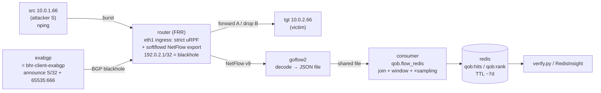

# QoB RTBH validation lab (Phase 0, step #2)

A self-contained [containerlab](https://containerlab.dev) topology that stands up
the **entire** QoB pipeline off production hardware so you can run a proof of
concept for step #2:

> When the router **drops** an attacker's traffic via source-based RTBH
> (uRPF + blackhole), does it still produce a **NetFlow** record we can count?

All components are **OSS and arm64-friendly** (goflow2 + a small Python consumer
+ Redis + RedisInsight + ExaBGP), matching the collector/store decision in
`plan-netflow-counting.md` §3.1.

> **Why Redis and not Elasticsearch?** Flow is a short-lived QoB *input* (needed
> for ~7 days), so we **aggregate-at-ingest** into Redis with a per-key TTL and
> keep the flow firehose **off the ES cluster**. The lab mirrors that exactly —
> there is no ES/Kibana in the flow path. (`flow_es.py` remains in the codebase
> as an optional alternative.)



## What this lab does and does NOT prove

- ✅ **Proves the pipeline + our code:** BGP RTBH trigger → recursive blackhole →
  strict-uRPF source drop → NetFlow export → goflow2 → consumer
  (`qob.ingest.flow_redis`, joining against a BHR-style blocklist) → Redis TTL
  counters. You get a **real NetFlow stream** through the production code path
  instead of CSV fixtures.
- ⚠️ **Does NOT prove hardware accounting order.** `softflowd` taps via libpcap,
  which sees packets **before** the kernel uRPF drop — so Phase B will usually
  still show flow here regardless. The pre/post-drop accounting question is
  ASIC-specific; answer it with **Cisco-native NetFlow** (see "Cisco-accurate
  variant") or **Cisco TAC / platform docs** for your exact prod model.

## Running on macOS / Apple Silicon (arm64)

containerlab is **Linux-only** — run it inside a lightweight Linux VM. Docker
Desktop alone is **not** enough (clab needs host netns access). Recommended:

```bash
# on macOS
brew install orbstack
orb create ubuntu clab-vm
orb -m clab-vm                 # shell into the Linux VM
# inside the VM:
bash -c "$(curl -sL https://get.containerlab.dev)"
sudo apt-get install -y docker.io curl
git clone <this repo> && cd quality-of-blocking
```

All lab images here are arm64-native, so they run directly in the VM.
(Alternatives: Lima/Colima or a Multipass/UTM Ubuntu VM.)

Published ports (reach them from the Mac host): **6379** (Redis) and **5540**
(RedisInsight). With OrbStack these are forwarded automatically; with other VMs
forward them yourself.

## Prerequisites

- Docker + containerlab (inside the Linux VM on macOS)
- Python deps for the verifier: `pip install -e '.[redis]'` (from repo root)

## Build & deploy

```bash
# from repo root
docker build -t qob/rtbh-router:latest lab/router
docker build -t qob/traffic:latest     lab/test
docker build -t qob/exabgp:latest      lab/exabgp
docker build -t qob/consumer:latest    lab/consumer

mkdir -p lab/.data/flows                       # shared goflow2↔consumer spool
sudo containerlab deploy -t lab/topology.clab.yml
```

Redis comes up with **AOF on** (`--appendonly yes`) so the 7-day counters
survive a restart. The consumer auto-starts, waits for goflow2's JSON file, and
tails it into Redis.

## See it in RedisInsight

RedisInsight runs at **http://localhost:5540**. On first launch, **add a
database**: host `redis` (or `127.0.0.1` if connecting via the published port),
port `6379`, no auth. Then:

- **Browser**: filter keys by `qob:*`. You'll see:
  - `qob:hits:10.0.1.66:YYYYMMDD` / `qob:bytes:...` — per-day counters (TTL ~8d).
  - `qob:rank:YYYYMMDD` — a **sorted set** of source IPs by dropped packets;
    open it to see the ranking the way clients would consume it.
  - `qob:meta:10.0.1.66` — the BHR `indicator_id` lineage.
- **Workbench** (run commands live):

```text
GET    qob:hits:10.0.1.66:20260611
TTL    qob:hits:10.0.1.66:20260611
ZREVRANGE qob:rank:20260611 0 9 WITHSCORES
```

Watch the counters climb as `run_ab_test.sh` fires bursts in another terminal.

## Run the proof-of-concept A/B test

```bash
bash lab/test/run_ab_test.sh
```

It sends 50k marked packets, reads the counts back from Redis (via the real
`qob.flow_redis` read path in `verify.py`), blocks the source via ExaBGP,
resends, reads again, and prints the interpretation table.

### Manual version

```bash
# Phase A — baseline
docker exec clab-qob-rtbh-src nping --tcp -p22 -g40001 -c50000 --rate5000 10.0.2.66
sleep 10 && python lab/test/verify.py --src 10.0.1.66 --label "phase A"

# Block, then Phase B
docker exec clab-qob-rtbh-exabgp /blackhole.sh block 10.0.1.66
docker exec clab-qob-rtbh-router ip route get 10.0.1.66    # -> blackhole
docker exec clab-qob-rtbh-src nping --tcp -p22 -g40001 -c50000 --rate5000 10.0.2.66
sleep 10 && python lab/test/verify.py --src 10.0.1.66 --label "phase B"

docker exec clab-qob-rtbh-exabgp /blackhole.sh unblock 10.0.1.66
```

## Interpreting results

| Phase A | Phase B (traffic confirmed dropped) | Meaning | Verdict |
|---|---|---|---|
| counts rise | counts rise ≈ same as A | accounted **before** drop | ✅ Option 1 viable |
| counts rise | counts ≈ flat | accounted **after** drop | ❌ pivot to Flowspec / sinkhole |
| no counts | — | exporter/consumer broken | debug goflow2/consumer first |

(With pcap-based softflowd, expect the first row — pipeline OK, ordering unproven.)

### Debugging the pipeline

```bash
docker exec clab-qob-rtbh-goflow2 tail -f /var/log/goflow2/flows.json   # decoded flow?
docker logs clab-qob-rtbh-consumer                                      # join/flush errors?
docker exec clab-qob-rtbh-redis redis-cli KEYS 'qob:*'                  # counters present?
docker exec clab-qob-rtbh-redis redis-cli ZREVRANGE qob:rank:$(date -u +%Y%m%d) 0 9 WITHSCORES
```

## Cisco-accurate variant (to actually probe accounting order)

Swap the `router` node for a Cisco image so flow is produced by the router's own
**Flexible NetFlow** (not pcap). On arm64, Cisco images are x86-only — use
**Cisco CML / a DevNet sandbox** or an **x86_64 Linux host**, not your Mac.
Replace the FRR config with IOS-XR/IOS-XE equivalents: `route-policy` matching
the blackhole community → `set next-hop discard`, loose uRPF
(`ipv4 verify unicast source reachable-via any`) on ingress, and a `flow monitor`
exporting to the goflow2 node. Everything downstream (goflow2 → consumer → Redis)
is unchanged.

## Teardown

```bash
sudo containerlab destroy -t lab/topology.clab.yml
rm -rf lab/.data/flows/*
```

## Files

| Path | Purpose |
|---|---|
| `topology.clab.yml` | containerlab topology (router, src, tgt, exabgp, goflow2, consumer, redis, redisinsight) |
| `router/Dockerfile` `router/frr.conf` `router/daemons` `router/setup.sh` | RTBH router: BGP + recursive blackhole + strict uRPF + softflowd |
| `exabgp/Dockerfile` `exabgp/exabgp.conf` `exabgp/blackhole.sh` | RTBH trigger image (stands in for bhr-client-exabgp) |
| `goflow2` (in topology) | decodes NetFlow → JSON file (no config; CLI flags) |
| `consumer/Dockerfile` `consumer/run.py` `consumer/blocklist.csv` | tails goflow2 JSON, joins BHR-style blocklist → Redis (`qob.flow_redis`) |
| `redis` `redisinsight` (in topology) | TTL counter store + UI (no config) |
| `test/Dockerfile` | src/tgt host image (nping) |
| `test/run_ab_test.sh` | end-to-end A/B driver (reads counts from Redis) |
| `test/verify.py` | reads QoB counts via the real `qob.flow_redis` read path |
