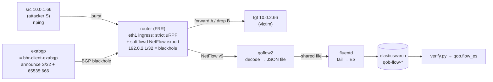

# QoB RTBH validation lab (Phase 0, step #2)

A self-contained [containerlab](https://containerlab.dev) topology that stands up
the **entire** QoB pipeline off production hardware so you can run a proof of
concept for step #2:

> When the router **drops** an attacker's traffic via source-based RTBH
> (uRPF + blackhole), does it still produce a **NetFlow** record we can count?

All components are **OSS and arm64-friendly** (goflow2 + Fluentd + Elasticsearch),
matching the collector decision in `plan-netflow-counting.md` §3.1.



## What this lab does and does NOT prove

- ✅ **Proves the pipeline + our code:** BGP RTBH trigger → recursive blackhole →
  strict-uRPF source drop → NetFlow export → goflow2 → Fluentd → Elasticsearch →
  `qob.ingest.flow_es` aggregation. You get a **real NetFlow stream** through the
  production code path instead of CSV fixtures.
- ⚠️ **Does NOT prove hardware accounting order.** `softflowd` taps via libpcap,
  which sees packets **before** the kernel uRPF drop — so Phase B will usually
  still show flow here regardless. The pre/post-drop accounting question is
  ASIC-specific; answer it with **Cisco-native NetFlow** (see "Cisco-accurate
  variant") or **Cisco TAC / platform docs** for your exact prod model.

## Running on macOS / Apple Silicon (arm64)

containerlab is **Linux-only** — run it inside a lightweight Linux VM. Docker
Desktop alone is **not** enough (clab needs host netns access). Recommended:

```bash
# on macOS
brew install orbstack
orb create ubuntu clab-vm
orb -m clab-vm                 # shell into the Linux VM
# inside the VM:
bash -c "$(curl -sL https://get.containerlab.dev)"
sudo apt-get install -y docker.io curl
git clone <this repo> && cd quality-of-blocking
```

All lab images here are arm64-native, so they run directly in the VM.
(Alternatives: Lima/Colima or a Multipass/UTM Ubuntu VM.)

## Prerequisites

- Docker + containerlab (inside the Linux VM on macOS)
- Python deps for the verifier: `pip install -e '.[es]'` (from repo root)
- `curl` (for the ES bootstrap)

## Build & deploy

```bash
# from repo root
docker build -t qob/rtbh-router:latest lab/router
docker build -t qob/traffic:latest     lab/test
docker build -t qob/fluentd-es:latest  lab/fluentd

mkdir -p lab/.data/flows                       # shared goflow2↔fluentd spool
sudo containerlab deploy -t lab/topology.clab.yml

# apply the ES index template (src_addr as `ip`) BEFORE any flow is indexed
bash lab/es/bootstrap.sh http://localhost:9200

# (optional) create the Kibana data view so Discover works out of the box
bash lab/es/kibana_dataview.sh http://localhost:5601
```

## See it in Kibana

Kibana runs at **http://localhost:5601** (no login — security is disabled in the
lab). The `kibana_dataview.sh` step above creates the `qob-flow-*` data view; if
you skipped it, add it manually: **Stack Management → Data Views → Create**,
title `qob-flow-*`, time field `@timestamp`.

Then, while/after running the A/B test:

- **Discover** (`/app/discover`): pick the `qob-flow-*` view, set the time picker
  to *Last 15 minutes*, and filter `src_addr : "10.0.1.66"` to watch the test
  source's flows arrive. Compare Phase A vs Phase B record counts here directly.
- **Quick chart (Lens):** X axis = `@timestamp` (date histogram), Y axis =
  `Sum of packets`, breakdown by `src_addr` — you'll see the blocked source's
  bar(s) over time, the visual version of `verify.py`'s `bh_hits`.
- Tip: if you want a live view, set Discover/Lens to auto-refresh every few
  seconds and run `run_ab_test.sh` in another terminal.

## Run the proof-of-concept A/B test

```bash
bash lab/test/run_ab_test.sh
```

It bootstraps the template, sends 50k marked packets, queries ES (via the real
`flow_es.py`), blocks the source via ExaBGP, resends, queries again, and prints
the interpretation table.

### Manual version

```bash
bash lab/es/bootstrap.sh                                  # once

# Phase A — baseline
docker exec clab-qob-rtbh-src nping --tcp -p22 -g40001 -c50000 --rate5000 10.0.2.66
sleep 8 && python lab/test/verify.py --src 10.0.1.66 --label "phase A"

# Block, then Phase B
docker exec clab-qob-rtbh-exabgp /blackhole.sh block 10.0.1.66
docker exec clab-qob-rtbh-router ip route get 10.0.1.66    # -> blackhole
docker exec clab-qob-rtbh-src nping --tcp -p22 -g40001 -c50000 --rate5000 10.0.2.66
sleep 8 && python lab/test/verify.py --src 10.0.1.66 --label "phase B"

docker exec clab-qob-rtbh-exabgp /blackhole.sh unblock 10.0.1.66
```

## Interpreting results

| Phase A | Phase B (traffic confirmed dropped) | Meaning | Verdict |
|---|---|---|---|
| flow present | flow ≈ same as A | accounted **before** drop | ✅ Option 1 viable |
| flow present | flow ≈ zero | accounted **after** drop | ❌ pivot to Flowspec / sinkhole |
| no flow | — | exporter/pipeline broken | debug goflow2/Fluentd/template first |

(With pcap-based softflowd, expect the first row — pipeline OK, ordering unproven.)

### Debugging the pipeline

```bash
docker exec clab-qob-rtbh-goflow2 tail -f /var/log/goflow2/flows.json   # decoded flow?
docker logs clab-qob-rtbh-fluentd                                       # shipping errors?
curl -s 'localhost:9200/qob-flow-*/_count'                              # docs landing?
curl -s 'localhost:9200/qob-flow-*/_mapping' | grep -A1 src_addr        # src_addr == ip?
```

## Cisco-accurate variant (to actually probe accounting order)

Swap the `router` node for a Cisco image so flow is produced by the router's own
**Flexible NetFlow** (not pcap). On arm64, Cisco images are x86-only — use
**Cisco CML / a DevNet sandbox** or an **x86_64 Linux host**, not your Mac.
Replace the FRR config with IOS-XR/IOS-XE equivalents: `route-policy` matching
the blackhole community → `set next-hop discard`, loose uRPF
(`ipv4 verify unicast source reachable-via any`) on ingress, and a `flow monitor`
exporting to the goflow2 node. Everything downstream is unchanged.

## Teardown

```bash
sudo containerlab destroy -t lab/topology.clab.yml
rm -rf lab/.data/flows/*
```

## Files

| Path | Purpose |
|---|---|
| `topology.clab.yml` | containerlab topology (router, src, tgt, exabgp, goflow2, fluentd, es, kibana) |
| `router/Dockerfile` `router/frr.conf` `router/daemons` `router/setup.sh` | RTBH router: BGP + recursive blackhole + strict uRPF + softflowd |
| `exabgp/exabgp.conf` `exabgp/blackhole.sh` | RTBH trigger (stands in for bhr-client-exabgp) |
| `goflow2` (in topology) | decodes NetFlow → JSON file (no config; CLI flags) |
| `fluentd/Dockerfile` `fluentd/fluent.conf` | tails goflow2 JSON → Elasticsearch (`qob-flow-*`) |
| `es/flow-index-template.json` `es/bootstrap.sh` | maps `src_addr` as `ip`; apply before indexing |
| `es/kibana_dataview.sh` | creates the `qob-flow-*` Kibana data view |
| `test/Dockerfile` | src/tgt host image (nping) |
| `test/run_ab_test.sh` | end-to-end A/B driver |
| `test/verify.py` | queries ES via the real `qob.flow_es` (GOFLOW2_FIELD_MAP) |
