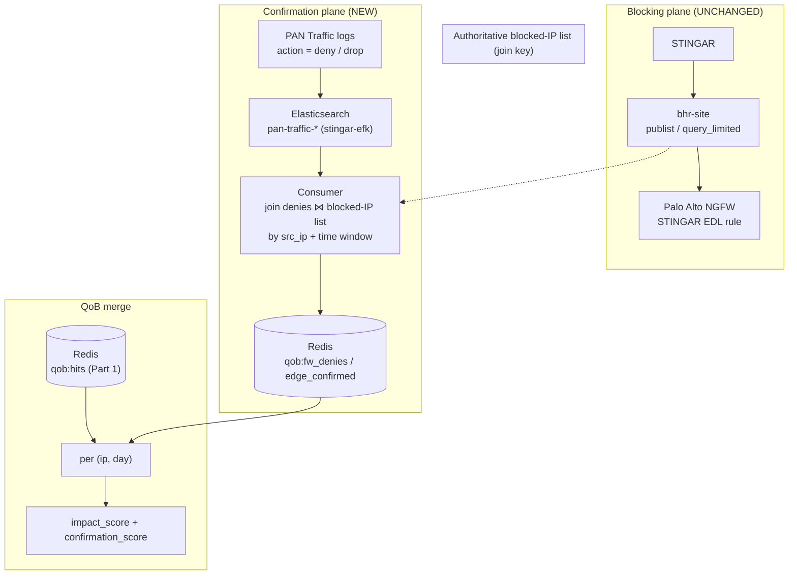
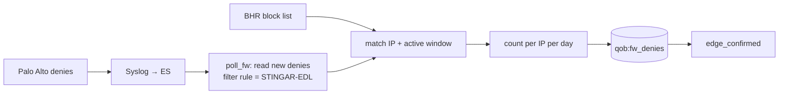
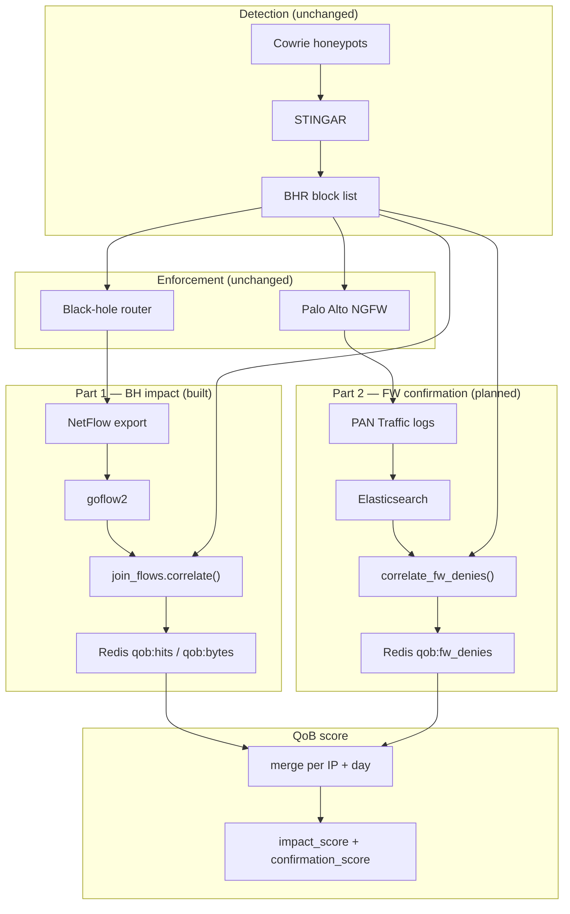

# Part 2 — NGFW deny counting for blocked IPs (Palo Alto default)

Companion plan to the [QoB overview](./README.md). Part 1 (black-hole impact) is
[`plan-netflow-counting.md`](./plan-netflow-counting.md). This describes **Part 2**:
count **policy deny events** per honeypot-flagged IP on the NG firewall **without
changing the block pipeline**, by correlating Palo Alto **Traffic logs** (or
equivalent) against the **same authoritative blocked-IP list** held by BHR.

> The blocking plane (Cowrie → STINGAR → BHR → NGFW EDL / blocklist rule) is
> left **unchanged**. This adds a parallel **confirmation plane** only.

---

## 0. Relationship to the QoB plan (read first)

README (add vs mark) defines two roles:

| Signal | QoB role | Part |
| --- | --- | --- |
| `bh_hits` / `bh_bytes` | **Add** — traffic sunk at BH | Part 1 (`plan-netflow-counting.md`) |
| `fw_deny_count` | **Mark** — `edge_confirmed` + small capped weight | Part 2 (this document) |

Do **not** sum BH bytes and FW bytes for the same packets unless network paths
are proven disjoint. Default: **BH drives `impact_score`; FW drives
`confirmation_score`.**

Part 1 is **implemented** (`qob/join_flows.py`, `qob/ingest/flow_redis.py`,
`lab/`). Part 2 is **planned** (`qob/ingest/fw_denies.py`, etc.).

Several architecture choices (EDL match direction, BH vs FW promotion timing,
ES field names) are **TBD** — see §10. Implementation can proceed with CSV
fixtures while discovery completes.

---

## 1. Goal and non-goals

### Goal

- Produce, per blocked IP and per time window, **`fw_deny_count`** (denied
  sessions / log rows) on the STINGAR EDL security rule, attributed to the
  honeypot `indicator_id` from BHR.
- Set **`edge_confirmed = true`** when ≥1 deny is seen while the IP's block
  entry is active.
- Feed **`confirmation_score`** = `w_f · min(fw_deny_count, cap)` (§9 below).

### Non-goals

- No change to Cowrie → STINGAR → BH → FW promotion pipeline.
- No replacement for BH impact measurement (that's Part 1).
- No Threat-log / zone-protection / dataplane-discard counters (not EDL policy
  denies). See `docs/black_hole_blocking.md` Part 1.
- No Palo Alto in containerlab for v1 — test with CSV/ES fixtures (like Part 1
  fixtures before the RTBH lab existed).

---

## 2. Architecture



### Part 2 pipeline (step by step)



### Full system — Part 1 + Part 2



---

## 3. What we count (Palo Alto default)

**Log type:** Security policy **Traffic** logs where:

- `action` ∈ `{deny, drop, reset-both, reset-client, reset-server}`
- `rule` = configured STINGAR EDL rule name(s) — the join key to STINGAR intel

**Not in scope:** Threat logs, zone-protection drops, `show counter global`
discards. Those are different enforcement layers (`docs/black_hole_blocking.md`).

**Match field:** `src_ip` by default (source-based blocks / RTBH alignment).
Confirm with security whether the EDL rule matches source or destination (§10).

**Granularity:** One Traffic log row ≈ one denied session (exact count; no
sampling scale). Optional `bytes` field stored but **not** added to
`impact_score`.

---

## 4. Correlation rules

Reuse `BlockedSet` from `qob/join_flows.py` (same BHR list, same
`block_start` / `block_end` semantics).

For each deny event:

1. Filter `action` and `rule` against config allowlists.
2. Take attacker IP from `src_ip` (or `dst_ip` if configured).
3. `entry = blocked.match(ip, deny.ts)` — skip if no active block.
4. Bucket `(ip, align_window(deny.ts))`; increment `fw_deny_count`.
5. Attach `indicator_id` from the matched `BlockEntry`.

Post-`removed` denies are excluded (same as Part 1 flow join tests).

**Deduping (optional v1.1):** dedupe on `(src, dst, sport, dport, proto,
sessionid)` if PAN session id is present in ES; otherwise count log rows and
document as a possible overcount.

---

## 5. Data model (additions to `qob/models.py`)

```python
@dataclass(frozen=True)
class FwDenyRecord:
    ts: datetime
    src_ip: str
    dst_ip: str
    action: str
    rule: str
    device_id: str = ""
    bytes: int = 0

@dataclass
class ConfirmationCount:
    ip: str
    window_start: datetime
    window_end: datetime
    fw_deny_count: int = 0
    edge_confirmed: bool = False
    indicator_id: str = ""
```

---

## 6. Repository layout (Part 2 additions)

```text
qob/
  join_fw_denies.py          # correlate() for denies (parallel to join_flows)
  ingest/
    fw_denies.py             # CSV, ES, PAN XML API parsers
    fw_redis.py              # qob:fw_denies:{ip}:{day} + meta
  scoring.py                 # confirmation_score(), qob_raw merge
collectors/
  poll_fw.py                 # scheduled ES / API poll
jobs/
  compute_qob.py             # extend: --source fw, merge bh+fw
config/
  sources.yaml.example       # firewall: rules, es_index, field map
tests/
  fixtures/fw_denies.csv
  test_join_fw.py
```

Part 1 modules stay unchanged; Part 2 is a **parallel ingest path** merged at
score time.

---

## 7. Ingest adapters (priority order)

| Priority | Adapter | When |
| --- | --- | --- |
| 1 | **CSV / JSONL replay** | Tests, Phase 0 sample export |
| 2 | **Elasticsearch** | Default production (`stingar-efk` PAN traffic index) |
| 3 | **PAN XML API** | Sites without syslog→ES; backfill only |

### 7.1 Elasticsearch (default)

Mirror `qob/ingest/flow_es.py`: push aggregation into ES, read back small
`(ip, window)` buckets. Filter on `action`, `rule.name`, time range, and
blocked source IPs.

Configurable field map (confirm in Phase 0):

```yaml
firewall:
  fields:
    src_ip: source.ip
    dst_ip: destination.ip
    action: event.action      # or pan-os specific field
    rule: rule.name
    timestamp: "@timestamp"
```

### 7.2 PAN XML API (optional)

Async job pattern from `docs/black_hole_blocking.md`:

```text
GET type=log&log-type=traffic&query=(action eq deny) and (rule eq 'STINGAR-EDL')
→ poll job-id → parse XML log entries → FwDenyRecord
```

Poll every 5–15 minutes; respect API rate limits.

### 7.3 CSV fixture schema (tests)

```csv
ts,src,dst,action,rule,device,bytes
2026-06-10T01:05:00Z,203.0.113.50,10.0.0.5,deny,STINGAR-EDL-BLOCK,fw1,800
```

---

## 8. Redis key schema

| Key | Purpose |
| --- | --- |
| `qob:fw_denies:{ip}:{YYYYMMDD}` | INCRBY deny count, TTL ~8d |
| `qob:meta:{ip}` | HSET `edge_confirmed`, `indicator_id`, `fw_last_seen` |
| `qob:fw:cursor` | Poll watermark (ES `search_after` or last timestamp) |

Align TTL with Part 1 (`flow_redis.py`, 8 days for rolling 7-day sums).

---

## 9. Scoring merge

```text
impact_score       = f(bh_hits, bh_bytes)           # Part 1 — unchanged
confirmation_score = w_f · min(fw_deny_count, cap)  # Part 2
edge_confirmed     = fw_deny_count > 0

QoB_raw = impact_score + confirmation_score + …   # other components later
```

Missing FW data → `edge_confirmed = false` (not an error).

**Interpretation:**

| BH | FW | Meaning |
| --- | --- | --- |
| High | High | Strong block, edge confirmed |
| High | Zero | BH working; FW not promoted or path bypasses FW |
| Zero | High | Long-term FW-only stage (`fw_long_term`) |
| High | Zero for days | Ops signal — EDL sync broken? |

---

## 10. Discovery checklist (security team — gate Part 2 build)

Answer before wiring production ES queries:

1. Exact STINGAR EDL **rule name(s)** on PAN / Panorama.
2. EDL matches **source** or **destination** IP?
3. Denies logged at full rate (suppression / log forwarding limits)?
4. ES **index pattern** and **field names** for a redacted Traffic deny sample.
5. FW promotion lag after BH (typical delay).
6. NAT: outer vs inner IP for `src_ip` in logs.
7. Is BHR the authoritative list for **both** BH and FW blocks, or FW-only?
8. Packet path: does BH sit upstream of PAN (FW denies may be rare even when blocking works)?

**Exit artifact:** 1 week ES export of `(action deny) AND (rule = STINGAR-…)`
with 2–3 `_source` documents for field mapping.

---

## 11. Implementation phases

### Phase 2a — Discovery (1 week)

- [ ] Complete §10 checklist.
- [ ] Redacted ES sample on disk.
- [ ] Confirm non-zero `fw_deny_count` for a known blocked IP.

### Phase 2b — Core (1 week)

- [ ] `FwDenyRecord`, `ConfirmationCount`, `join_fw_denies.correlate()`.
- [ ] `fw_denies.load_csv()` + fixtures + `test_join_fw.py`.
- [ ] `confirmation_score()` in `scoring.py`.

### Phase 2c — ES adapter (1 week)

- [ ] `EsFwDenySource` (pattern from `flow_es.py`).
- [ ] CI replay against captured ES JSON export.

### Phase 2d — Collector + Redis (1 week)

- [ ] `fw_redis.py`, `poll_fw.py`, watermarking.
- [ ] Extend `compute_qob` to merge BH + FW JSONL output.

### Phase 2e — PAN API (optional)

- [ ] XML API adapter for non-ES sites.

---

## 12. Pitfalls

1. **Double counting with BH** — same packets may never reach FW if BH drops
   first; keep streams separate.
2. **Promotion lag** — correlate using BHR `added`/`removed`, not “on FW list now”.
3. **Wrong log type** — Threat / zone-protection ≠ EDL confirm.
4. **Session-end logging** — deny may appear minutes after packet; use
   `receive_time` / `@timestamp`.
5. **Log suppression** — `fw_deny_count` may be a lower bound under heavy scan volume.
6. **NAT** — document which IP is scored (§10 open question #6).
7. **Multi-FW** — sum across fleet or dedupe by session id per device.

---

## 13. Testing strategy

| Layer | Approach |
| --- | --- |
| Join | `test_join_fw.py` + `fixtures/fw_denies.csv` |
| Adapter | Record/replay ES PAN traffic JSON |
| Integration | Weekly CI replay (no live PAN in CI) |
| Validation | Spot-check top confirmed IPs in PAN Traffic log GUI |

No Palo Alto containerlab for v1 (contrast with Part 1 `lab/`).

---

## 14. Config sketch (`config/sources.yaml.example`)

```yaml
firewall:
  vendor: paloalto
  match_field: src_ip
  deny_actions: [deny, drop, reset-both]
  rules:
    - STINGAR-EDL-BLOCK
  source: elasticsearch
  es_url: https://es.example.edu:9200
  es_index: "pan-traffic-*"
  poll_interval_seconds: 300
  fields:
    src_ip: source.ip
    dst_ip: destination.ip
    action: event.action
    rule: rule.name
    timestamp: "@timestamp"
```

---

## 15. References

- [README](./README.md) — QoB overview, add vs mark
- [`plan-netflow-counting.md`](./plan-netflow-counting.md) — Part 1 BH impact
- [`docs/black_hole_blocking.md`](./docs/black_hole_blocking.md) — PAN Traffic
  log filters, XML API, STINGAR-EDL correlation (Part 1 NGFW section)
