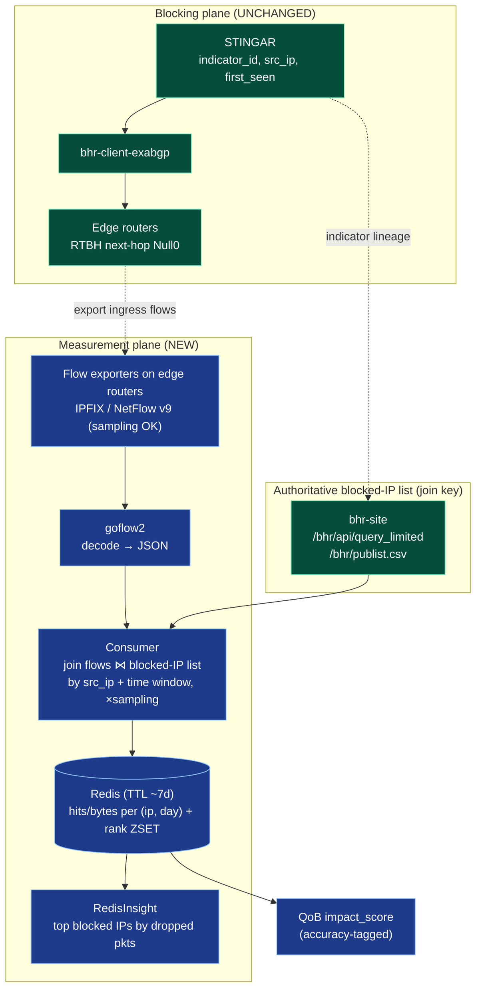

# Option 1 — Flow-based packet counting for black-holed IPs

Companion plan to `[plan.md](./plan.md)`. This describes **Option 1**: count
packets/bytes per honeypot-flagged IP that hits a black-hole router **without
changing the RTBH mechanism**, by correlating router **flow telemetry**
(NetFlow v9 / IPFIX / sFlow) against the **authoritative blocked-IP list** held
by BHR (and lineage from STINGAR / Cowrie).

> The blocking plane (Cowrie → STINGAR → `bhr-client-exabgp` → RTBH Null0) is
> left **unchanged**. This adds a parallel **measurement plane** only.

---

## 0. Relationship to the QoB plan (read first)

`plan.md` originally built `impact_score` on **exact** BH counters. **For v1
this constraint is relaxed: sampled estimates are acceptable.** Plain RTBH to
`Null0` exposes no per-IP counter (the discard interface aggregates all
blackholed traffic), so flow telemetry — **sampled or not** — is the
least-disruptive way to attribute drops to specific IPs. We accept the
statistical error of sampling now and treat exactness as a **later refinement**,
not a v1 blocker.

Reconciliation rules (v1):


| Condition                                  | Decision                                                                   |
| ------------------------------------------ | -------------------------------------------------------------------------- |
| Per-IP ACL / Flowspec counters available   | Prefer `plan.md` §4.2 (exact) if cheap; otherwise this plan is fine.       |
| Only `Null0` aggregate counter available   | Use this plan. Unsampled IPFIX/NetFlow v9 if available, **sampled is OK**. |
| Only **sampled** NetFlow / sFlow available | **Accepted for v1.** Feeds `bh_hits`/`bh_bytes` and QoB rank directly.     |


`impact_score` inputs (`bh_hits`, `bh_bytes`) still carry an `accuracy` field
(`exact_unsampled`  `estimated_sampled`) and the `sampling_rate` used — this
is **provenance only**, not a gate. Sampled values **do** feed the QoB rank in
v1. Tightening to exact counts is a possible v2 refinement.

---

## 1. Goal and non-goals

### Goal

- Produce, per blocked IP and per time window, `**bh_hits`** (packets) and
`**bh_bytes**` dropped at the black-hole edge, attributed to the honeypot
indicator that caused the block — **without modifying RTBH**.
- **Estimates are acceptable for v1.** Sampled flow (scaled by `sampling_rate`)
is good enough to rank relative blocking impact; exact counts are a later
refinement, not a requirement.

### Non-goals

- No change to the block pipeline or RTBH next-hop (that's Option 2 / sinkhole).
- No Flowspec per-rule counters (that's Option 3).
- No payload inspection (flow records are headers/aggregates only).
- Not a replacement for exact ACL counters where those exist.

---

## 2. Architecture




### Deployment: source-based RTBH (confirmed)

We use **source-based RTBH (S/RTBH)**: the blackhole route is installed on the
**attacker's source `/32`**, and **uRPF (loose mode)** on ingress interfaces
drops any packet whose *source* address resolves to `Null0`. So the blocked
entry in BHR **is the attacker**, and the correlator joins flow `**src_ip`**
against the blocked-IP list.

### Why ingress flow accounting still sees the traffic

The packet is received on the router's **ingress** interface and *then* dropped
by the uRPF/`Null0` decision. On most platforms **ingress** NetFlow/IPFIX
accounting records the packet **before** the discard, so the flow record still
exists. Validate this per-platform in Phase 0 (some implementations account
after the forwarding decision).

> uRPF caveat: loose uRPF interacts badly with **asymmetric routing** — a legit
> packet entering on an interface whose return path differs can be dropped, and
> conversely flow capture points must sit where the dropped source traffic is
> actually accounted. Confirm capture coverage in Phase 0.

---

## 3.1 Collector + store decision: goflow2 → consumer → Redis (ES off the flow path)

Flow telemetry is a **QoB input only** (we need `src_ip, packets, bytes,
sampling, timestamp` — not raw-flow drill-down or org-wide dashboards) and is
**useless after ~7 days**. Pointing that high-churn firehose at Elasticsearch
would tax the **cluster** (indexing load) and disk, even with ILM. So we keep
flow **off ES entirely** and aggregate at ingest into **Redis** (already in the
stack via hpfeeds-bhr), with a **per-key TTL** that *is* the 7-day retention.

**Chosen:** **goflow2** (OSS, arm64) decodes NetFlow/IPFIX/sFlow → JSON; a small
**consumer** joins against the BHR blocked set and writes **Redis** counters.
Counts/rankings are read back for serving (and viewed via **RedisInsight**).

```text
Routers ──NetFlow/IPFIX/sFlow──▶ goflow2 ──JSON──▶ consumer ──▶ Redis (TTL 7d)
 (exporter)                       (decode)          • join src ⋈ BHR blocked set
                                                    • window + ×sampling_rate
                                                    • INCRBY / ZINCRBY / EXPIRE
   Elasticsearch: NOT in the flow path ✅           qob.ingest.flow_redis
```

**Aggregate-at-ingest** is the key move: volume affects only consumer throughput,
not storage (a million flows and a thousand collapse to the same per-IP/day
keys). Throughput knobs: exporter **sampling**, **horizontally scale** the
consumer (shard by src IP), optional **goflow2 → Kafka** buffer at very high
rates.

Decisions / caveats locked in:

- **Code:** `flow_redis.RedisQobStore` + `ingest_flows()` reuse
  `join_flows.correlate` (same join/window/sampling logic), writing per-`(ip,
  day)` counters + a `rank` sorted set. `flow_counters.flow_from_goflow2()`
  parses goflow2's native JSON.
- **Key schema:** `qob:hits:{ip}:{YYYYMMDD}`, `qob:bytes:...`,
  `qob:rank:{day}` (ZSET), `qob:meta:{ip}` — all with TTL (default 8 days so a
  rolling 7-day sum is safe).
- **Sampling:** counts scaled by `sampling_rate` at write time (tagged in the
  ImpactCount; estimates accepted for v1).
- **Active-window filter:** `BlockedSet.match(ip, window_start)` honors per-IP
  `block_start`/`block_end` and attaches `indicator_id` from BHR.
- **Dedup:** within a batch via `correlate(dedupe=True)`; across batches /
  multi-router use `RedisQobStore.seen_flow()` (SET NX EX guard).
- **Durability:** counts are client-facing → enable Redis **AOF** (or RDB) so a
  restart doesn't lose the week.
- **Visualization:** **RedisInsight** (no Kibana on the flow path).
- **Reversible:** `flow_es.py` (ES aggregation) is retained as an OPTIONAL
  alternative if org-wide flow analytics is ever wanted — switching store is
  contained to the ingest/serving layer.
- **CSV harness retained:** `flow_counters.py` (nfdump CSV) stays as the
  hardware-free test/replay path and dedupes flows.

---

## 3. Key design decisions


| Decision          | Options                                                   | Default                                                                                                                        |
| ----------------- | --------------------------------------------------------- | ------------------------------------------------------------------------------------------------------------------------------ |
| Telemetry type    | IPFIX, NetFlow v9, sFlow                                  | **Whatever the routers already export**; IPFIX/NetFlow v9 preferred, sFlow fine for v1                                         |
| Sampling          | 1:1 (unsampled) vs 1:N                                    | **Sampling accepted.** Record `sampling_rate` and scale counts by it                                                           |
| Direction key     | match on `src_ip` vs `dst_ip`                             | `**src_ip`** — deployment is source-based RTBH (S/RTBH); blocked entry is the attacker                                         |
| Collector         | goflow2, nfdump (nfcapd), pmacct, ElastiFlow             | **goflow2 → consumer** (OSS, arm64; see §3.1). **nfdump CSV** kept as the offline test/replay harness                         |
| Store             | Elasticsearch vs **Redis (TTL)** vs flat files          | **Redis**, aggregate-at-ingest, per-key 7d TTL (§3.1). Keeps the flow firehose off the ES cluster. `flow_es.py` optional      |
| Correlation locus | in Python (consumer) vs in Elasticsearch                 | **in the consumer** (`join_flows.correlate`); ES agg path retained as optional alt                                            |
| Dedup             | same flow seen on N routers                               | within batch via `correlate(dedupe=True)`; across batches/multi-router via `RedisQobStore.seen_flow()` (SET NX EX)            |
| Window            | align to block episode vs fixed buckets                   | fixed **5–15 min** buckets, rolled up to 24h/7d, clipped to `[block_start, block_end]`                                         |


---

## 4. Components to build

```text
quality-of-blocking/
└── qob/
    ├── models.py               # DONE: FlowRecord, BlockEntry, ImpactCount
    ├── scoring.py              # DONE: impact_score(bh_hits, bh_bytes)
    ├── join_flows.py           # DONE: BlockedSet, dedupe, correlate (source-based)
    └── ingest/
        ├── flow_counters.py    # DONE: nfdump/CSV + goflow2-JSON → FlowRecord (test harness, dedupes)
        ├── flow_redis.py       # DONE: RedisQobStore + ingest_flows (CHOSEN store, TTL serving)
        ├── flow_es.py          # DONE: ES aggregation → ImpactCount (OPTIONAL alternative)
        └── bhr_list.py         # DONE: blocked-IP list (publist.csv / query_limited)
jobs/
└── compute_qob.py             # DONE: CLI, --source csv|es
collectors/
└── poll_flows.py              # STUB: Phase 2 scheduled reader / store writes
config/
└── sources.yaml.example       # DONE: rtbh_direction=source, exporters[], collector=goflow2
```

These feed the `impact_score` inputs in `qob/scoring.py` (`bh_hits`,
`bh_bytes`) — annotated with `accuracy` + `sampling_rate` provenance.

---

## 5. Correlation logic

Deployment is **source-based RTBH**, so the attacker is the flow **source**.
For each flow record `f` in window `W`

1. Take the **attacker IP** from the source field: `ip = f.src_addr`.
2. Look up `ip` in the **blocked-IP set** active during `W` (from BHR list,
  with `block_start`/`block_end`).
3. If matched and `f` overlaps `[block_start, block_end]`:
  - `bh_hits[ip, W] += f.packets * sampling_scale`
  - `bh_bytes[ip, W] += f.bytes * sampling_scale`
  - tag `accuracy = exact_unsampled` if `sampling_rate == 1` else `estimated_sampled`
4. Attach `indicator_id` from the BHR/STINGAR lineage for the matched IP.
5. Dedupe identical 5-tuple flows reported by multiple routers; only **sum**
  across routers when their forwarding paths are proven disjoint.

`sampling_scale = sampling_rate` (1 for unsampled). Store both raw and scaled.

---

## 6. Implementation phases

### Phase 0 — Discovery & validation (1–2 weeks)

- Confirm which edge routers handle RTBH and what flow they already export;
record `sampling_rate` per device (unsampled not required — just known).
- Confirm **ingress** flow accounting records packets dropped to `Null0`
(lab test with a known IP; compare flow bytes vs interface drop counters).
- RTBH direction confirmed **source-based (S/RTBH)** → join on `src_ip`.
- Confirm where uRPF-dropped source traffic is accounted so flow capture
points cover it (uRPF + asymmetric routing coverage check).
- Collector chosen: **goflow2 → consumer → Redis** (§3.1); nfdump CSV kept for replay.
- Size the consumer for peak flows/sec; confirm exporter `sampling_rate` per device.
- Stand up Redis with **AOF/RDB** persistence; set TTL == retention (~7d).
- Export 1 week of flow captures + BHR `publist.csv` snapshots for replay.

**Exit:** For one test IP, flow-derived packet count is non-zero and within a
documented error band of an independent counter.

### Phase 1 — Offline correlator on captured data — DONE

- `bhr_list.py` — load blocked-IP list with `block_start/end`, `indicator_id`.
- `flow_counters.py` — parse nfdump/CSV → normalized flow rows (dedupes).
- `flow_redis.py` — `RedisQobStore` + `ingest_flows` (chosen store, TTL serving).
- `flow_es.py` — ES `terms→date_histogram→sum` aggregation → `ImpactCount` (optional alt).
- `join_flows.py` — §5 logic; emits `(ip, window, bh_hits, bh_bytes, accuracy, indicator_id)`.
- `compute_qob.py` — CLI with `--source csv|es`.
- Unit tests: CSV (matched, unmatched, sampled, multi-router dupes, window edges),
ES (fake client) and Redis (fake client: counters, additivity, TTL, ranking,
dedupe guard, goflow2 parse). **18 passing.**

**Exit:** Deterministic per-IP counts from captured/fake data. ✅

### Phase 2 — Production wiring (1–2 weeks)

- Run the **consumer** against live goflow2 output; confirm goflow2 JSON keys.
- Multi-router setups: gate counting on `RedisQobStore.seen_flow()` (§3.1).
- Deploy consumer (cron/k8s) fed by BHR's blocked set; write Redis counters with TTL.
- Counters are additive; use the dedupe guard for idempotency across redelivery.
- Observability: flows/sec, % matched to blocked IPs, Redis memory, consumer lag.
- **RedisInsight** for top blocked IPs by dropped packets (no Kibana on flow path).

**Exit:** Automated per-IP `bh_hits`/`bh_bytes` refresh in dev/staging.

### Phase 3 — Accuracy & integration (1 week)

- Emit `accuracy` tag end-to-end; ensure scorer/severity respect it.
- Validate against any available exact counter on a subset (drift report).
- Document sampling error bands in `docs/severity-hooks.md`.

**Exit:** QoB records show flow-derived impact with accuracy provenance.

---

## 7. Testing


| Layer      | Approach                                                                            |
| ---------- | ----------------------------------------------------------------------------------- |
| Parse      | nfdump CSV golden files; goflow2 JSON parser; ES + Redis via fake clients            |
| Join       | Fixtures: matched/unmatched IPs, window-edge overlaps, active/expired blocks         |
| Sampling   | Verify `sampling_scale` math and `accuracy` tagging (CSV + ES + Redis paths)         |
| Dedup      | CSV: same 5-tuple from 2 routers → counted once. Redis: `seen_flow()` SET NX guard   |
| Store      | Redis fake: counter additivity, TTL applied, ZSET ranking merge over days           |
| Validation | Spot-check top IPs vs interface/ACL counters where available                        |


---

## 8. Risks & caveats

- **Sampling = estimate (accepted for v1).** sFlow and 1:N NetFlow are
statistical. v1 accepts this; counts are scaled by `sampling_rate` and tagged
`estimated_sampled`. Error is largest for **low-volume** IPs (few packets may
be missed entirely) — keep this in mind when ranking small offenders.
- **Accounting order.** If a platform accounts *after* the forwarding/discard
decision, dropped packets won't appear in flows; fall back to Option 2/3.
- **Multi-router double counting.** Asymmetric routing can report the same flow
on several devices. The CSV path dedupes within a batch; across batches /
exporters gate counting on `RedisQobStore.seen_flow()` (SET NX EX) before
trusting absolute counts.
- **Redis durability.** Counts are client-facing → enable **AOF** (or RDB) so a
restart doesn't drop the week. Size memory for active-IP × 7 daily buckets.
- **Consumer throughput.** Aggregate-at-ingest means volume hits the consumer,
not storage — scale consumers (shard by src IP) and/or buffer goflow2 → Kafka
at very high flow rates.
- **Active/inactive timeouts.** Long attacks span multiple flow records; align
flow timestamps to QoB windows, don't double-count split flows.
- **NAT / shared IPs.** Same caveat as `plan.md` §8 — document inner vs outer IP.
- **Volume.** Unsampled flow at edge can be high; size the collector and
pre-filter to the blocked-IP set early if possible.

---

## 9. Open questions

1. What `sampling_rate` do the RTBH routers export at, and is it stable? (Exactness not required for v1.)
2. ~~Direction~~ **Resolved: source-based RTBH (S/RTBH via uRPF) → join on `src_ip`.** Remaining sub-question: where are uRPF-dropped sources accounted, so flow capture points have full coverage?
3. ~~Collector + store choice~~ **Resolved: goflow2 → consumer → Redis (TTL), ES off the flow path (§3.1).** Sub-question: peak flows/sec the consumer must sustain, and shard/Kafka threshold?
4. Pull blocked-IP list from **BHR** (`query_limited`) or **STINGAR** directly? (Both are in ES already — could even do the whole join in ES later.)
5. (v2) If/when exactness matters, what error band is acceptable before we switch to ACL/Flowspec counters?

---

## 10. Immediate next steps

1. ~~Build Phase 1 correlator + tests~~ **DONE** (`flow_counters.py`, `flow_redis.py`, `flow_es.py`, `join_flows.py`, `compute_qob.py`, 18 tests).
2. ~~Stand up the goflow2 → consumer → Redis + RedisInsight PoC lab~~ **DONE** (`lab/`).
3. Run Phase 0 capability check with neteng (sampling rate, ingress accounting, uRPF capture coverage).
4. Capture 1 week of flow + `publist.csv` snapshots; validate one test IP's count vs an independent counter (error band).
5. Phase 2: run the consumer against live goflow2, gate on `seen_flow()`, schedule it, RedisInsight view.

