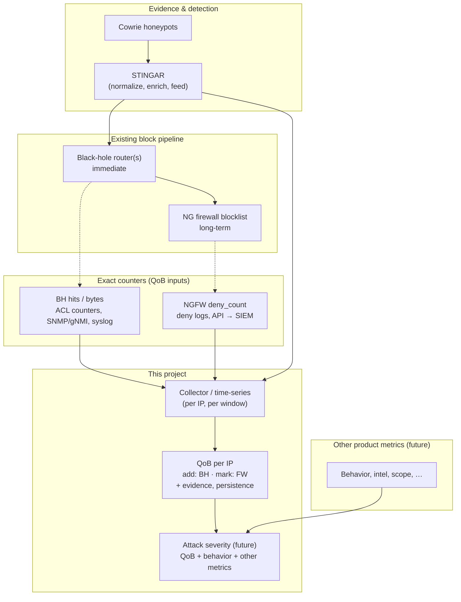

# Quality of Blocking (QoB) — Implementation Plan

Per-IP quantitative score that measures how strongly we block Cowrie-sourced
threats, using **exact** counters from black-hole routers and NG firewalls.
QoB is a first-class product metric that will later fuse with behavior and
platform telemetry to produce an **attack severity** rating.

---

## 1. Goals and non-goals

### Goals

- Compute a **QoB rank per IP** (and optionally per block episode / `indicator_id`).
- Ingest **exact** black-hole (BH) hit/byte counters — **add** to score.
- Ingest **exact** NG firewall deny counts — **mark** edge confirmation (and optional small weight).
- Join counters with **STINGAR / Cowrie lineage** (evidence, timestamps, sensor).
- Expose a stable **API / export schema** so other teams can aggregate QoB into severity.
- Support time windows (24h, 7d, lifetime) and decay for rolling rankings.

### Non-goals (v1)

- Replacing the existing block pipeline (Cowrie → STINGAR → BH → FW blocklist).
- Deriving block counts from NetFlow or sFlow sampling.
- Building the full severity model (v2); only design hooks and normalized sub-scores.
- Auto-changing block TTL or promotion rules from QoB (optional v2).

---

## 2. Current production flow (baseline)



| Stage | Role | Horizon |
| --- | --- | --- |
| Cowrie | Ground-truth attacker behavior | Event time |
| STINGAR | Dedup, enrich, push block feeds | Minutes |
| BH routers | Fast network-level discard | Immediate on feed |
| NGFW blocklist | Durable edge deny | Long-term |

---

## 3. QoB model

### 3.1 Semantics: add vs mark

| Signal | Source | QoB treatment |
| --- | --- | --- |
| BH hits / bytes | Black-hole routers | **Add** — measurable traffic sunk |
| FW deny count | NG firewall blocklist rule | **Mark** `edge_confirmed` + optional capped weight |
| Honeypot sessions | Cowrie via STINGAR | **Evidence** component (prior / confidence) |
| Time on blocklists | STINGAR + enforcement state | **Persistence** component |
| Whitelist / churn | Ops overrides | **Penalty** |

Do **not** blindly sum BH bytes and FW bytes for the same packets unless
network paths are proven disjoint. Default: BH drives impact; FW confirms.

### 3.2 Components (store all; expose scalar + breakdown)

```text
evidence_score     — Cowrie session count, sensors, recency (from STINGAR)
impact_score       — f(bh_hits, bh_bytes) with log cap on bytes
confirmation_score — fw_deny_count, edge_confirmed flag
persistence_score  — minutes on BH + FW lists, renewals
penalty_score      — whitelist hits, rapid add/remove churn
```

### 3.3 Scalar (v1 — tunable constants)

```text
QoB_raw = w_e·E + w_b·log(1 + bh_bytes) + w_h·bh_hits
        + w_f·min(fw_deny_count, cap) + w_p·P − w_n·N

QoB_rank = percentile_or_tier(QoB_raw)   # 0–100 and/or Low/Med/High/Critical
```

Apply **time decay** on rolling windows; keep immutable audit totals separately.

### 3.4 Record schema (v1)

```json
{
  "ip": "203.0.113.50",
  "indicator_id": "uuid-from-stingar",
  "stage": "bh_active | fw_long_term",
  "window": "24h",
  "as_of": "2026-06-04T12:00:00Z",
  "qob_raw": 847.2,
  "qob_rank": 92,
  "components": {
    "evidence_score": 120,
    "impact_score": 700,
    "confirmation_score": 42,
    "persistence_score": 85,
    "penalty_score": 0,
    "bh_hits": 1200,
    "bh_bytes": 980000,
    "fw_deny_count": 42,
    "edge_confirmed": true,
    "cowrie_sessions": 3
  }
}
```

---

## 4. Data sources and instrumentation

### 4.1 Discovery checklist (block before build)

Answer with neteng / security:

1. BH platform and mechanism (Null0, RTBH, ACL, Flowspec)?
2. Per-IP (/32) counters vs one global BH counter?
3. NGFW vendor and exact **blocklist rule name** in logs?
4. Are denies logged at full rate (no suppression)?
5. Log stack (Splunk, Elastic, Sentinel, on-prem only)?
6. STINGAR export format and fields for `src_ip`, `indicator_id`, `first_seen`?

### 4.2 Black-hole router hits

| Method | When to use | Output |
| --- | --- | --- |
| ACL / filter counters (SNMP, gNMI) | Per-prefix or per-IP ACE counters | `bh_hits` delta, optional bytes |
| Syslog on deny | Counter unavailable; moderate volume | Count events by dst/src IP |
| Interface / Null0 counters | Single aggregation point only | Fleet totals, not per-IP |

**Collector:** poll every 5–15 minutes; store deltas per `(device_id, ip|prefix, rule_id)`.

### 4.3 NG firewall deny_count

| Method | When to use | Output |
| --- | --- | --- |
| Deny traffic logs → SIEM | Default | `count by src_ip` for blocklist rule |
| Vendor API (Panorama, FortiAnalyzer, FMC) | Scheduled batch if SIEM laggy | Same aggregation |
| Rule hit counter only | Sanity check | Not sufficient for per-IP QoB alone |

**Collector:** SIEM query or API job every 5–15 minutes; key on `src_ip`, `rule`, `action=deny`.

### 4.4 STINGAR / Cowrie evidence

- Reuse patterns from `~/Projects/stingar-test/scripts/stingar_io.py` for Elasticsearch JSON exports (triple-quote normalization).
- Production: STINGAR API or ES index subscription for session `_source` (src IP, timestamp, sensor, commands metadata).
- Map each blocked IP to **`indicator_id`** and first Cowrie sighting time.

---

## 5. Proposed repository layout

```text
quality-of-blocking/
├── plan.md                    # this document
├── pyproject.toml
├── README.md
├── config/
│   ├── qob_weights.yaml       # w_e, w_b, caps, decay half-lives
│   └── sources.yaml.example   # BH devices, FW rule names, SIEM endpoints
├── qob/
│   ├── models.py              # QoBRecord, components dataclasses
│   ├── scoring.py             # QoB_raw, rank, decay
│   ├── join.py                # correlate IP + indicator_id across streams
│   └── ingest/
│       ├── bh_counters.py     # SNMP/gNMI/syslog adapters
│       ├── fw_denies.py       # SIEM / NGFW API adapters
│       └── stingar.py         # evidence loader (port stingar_io patterns)
├── collectors/
│   ├── poll_bh.py               # scheduled BH counter job
│   └── poll_fw.py               # scheduled FW deny aggregation job
├── jobs/
│   └── compute_qob.py           # roll windows, write outputs
├── tests/
│   ├── test_scoring.py
│   ├── fixtures/                # sample BH/FW/STINGAR snippets
│   └── test_join.py
└── docs/
    └── severity-hooks.md        # how QoB feeds future severity fusion
```

---

## 6. Implementation phases

### Phase 0 — Discovery and validation (1–2 weeks)

- [ ] Complete §4.1 checklist with neteng and security.
- [ ] Identify one **lab or known-bad IP**; confirm BH counter increments and FW deny logs appear.
- [ ] Document log field names (`src`, `dst`, `rule`, `action`, `bytes`).
- [ ] Export 1 week sample: STINGAR sessions, BH counter dumps, FW deny logs.
- [ ] Decide grain: per-IP daily rollup vs block **episode** keyed by `indicator_id`.

**Exit criteria:** Sample data on disk; per-IP counts demonstrably non-zero for a test IP.

### Phase 1 — Scoring core (1 week)

- [ ] Define `QoBRecord` and component types in `qob/models.py`.
- [ ] Implement `scoring.py` with configurable weights (`config/qob_weights.yaml`).
- [ ] Unit tests with synthetic fixtures (BH-only, FW-only, both, penalties).
- [ ] CLI: `python -m jobs.compute_qob --from-fixtures tests/fixtures/`.

**Exit criteria:** Deterministic QoB output from static JSON inputs; documented formula.

### Phase 2 — Ingest adapters (2–3 weeks)

- [ ] `stingar.py` — load sessions; emit `(ip, indicator_id, evidence fields)`.
- [ ] `bh_counters.py` — first adapter matching production (SNMP **or** syslog **or** file replay).
- [ ] `fw_denies.py` — first adapter (SIEM export file **or** API stub with replay).
- [ ] `join.py` — merge streams on IP + time window; handle missing FW marks.

**Exit criteria:** End-to-end run on 1-week sample files produces QoB table.

### Phase 3 — Collectors and storage (2 weeks)

- [ ] Scheduled `poll_bh.py` / `poll_fw.py` (cron, systemd, or k8s CronJob).
- [ ] Time-series store choice: Postgres, Timescale, or Elastic index `qob-*`.
- [ ] Idempotent writes keyed by `(ip, window_start, source)`.
- [ ] Basic observability: last successful poll, row counts, lag alerts.

**Exit criteria:** Automated daily QoB refresh in dev/staging.

### Phase 4 — Product surface (1–2 weeks)

- [ ] REST or batch export (JSON Lines / Parquet) for downstream severity pipeline.
- [ ] Rank bands documented (`observe`, `block_bh`, `block_fw`, `critical`).
- [ ] Dashboard spec: top QoB IPs, component breakdown, BH vs FW confirmation rate.
- [ ] `docs/severity-hooks.md` — placeholder weights for `severity = F(qob, behavior, …)`.

**Exit criteria:** Consumers can pull QoB by IP and window without reading BH/FW directly.

### Phase 5 — Calibration and production (ongoing)

- [ ] Tune weights and caps against analyst feedback (false rank outliers).
- [ ] Add decay and promotion-tier alignment with STINGAR block stages.
- [ ] Load test syslog/SIEM query paths; rate-limit safety.
- [ ] Runbook: counter reset, whitelist penalty, indicator_id collisions.

---

## 7. Testing strategy

| Layer | Approach |
| --- | --- |
| Scoring | Pure unit tests; golden files for `QoB_raw` / `qob_rank` |
| Join | Fixtures with overlapping BH+FW timestamps, NAT edge cases |
| Adapters | Record/replay captured SNMP walks and SIEM JSON exports |
| Integration | Weekly sample pipeline in CI (no live network in CI) |
| Validation | Manual spot-check top 20 QoB IPs against raw logs |

---

## 8. Open questions

1. **IPv6 and NAT** — score inner vs outer IP; document choice.
2. **Shared IPs / CDN** — cap QoB or require FW mark before high tier?
3. **Multiple BH routers** — sum, max, or dedupe by `(indicator_id, day)`?
4. **STINGAR block timing** — same second on BH and FW, or delayed FW promotion?
5. **Retention** — hot QoB windows vs cold audit archive duration.

---

## 9. Dependencies on other teams

| Team | Deliverable |
| --- | --- |
| Neteng | BH counter access (SNMP/gNMI/syslog), device inventory |
| Security | NGFW deny logging on blocklist rule, rule name / UUID |
| STINGAR | Stable `indicator_id`, IP feed events, ES/API access |
| Platform / data | SIEM queries or Kafka topics, staging DB |
| Product | Rank band definitions, severity fusion timeline |

---

## 10. Success metrics

- **Coverage:** ≥95% of Cowrie-fed blocklist IPs have a QoB record within 24h of first block.
- **Freshness:** QoB `as_of` lag ≤ 30 minutes from collector schedule in production.
- **Explainability:** Every `qob_rank` traceable to component breakdown and source timestamps.
- **Adoption:** Severity pipeline (v2) consumes QoB export without custom BH/FW scrapers.

---

## 11. Immediate next steps

1. Initialize Python package (`pyproject.toml`, `qob/` skeleton).
2. Copy/adapt `stingar_io.py` from `stingar-test` into `qob/ingest/stingar.py`.
3. Run Phase 0 discovery checklist with neteng and security.
4. Implement Phase 1 scoring + tests using fabricated counter inputs.
5. Replay one week of sample logs through Phase 2 adapters before touching production APIs.
