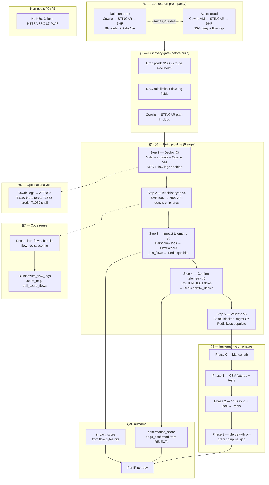
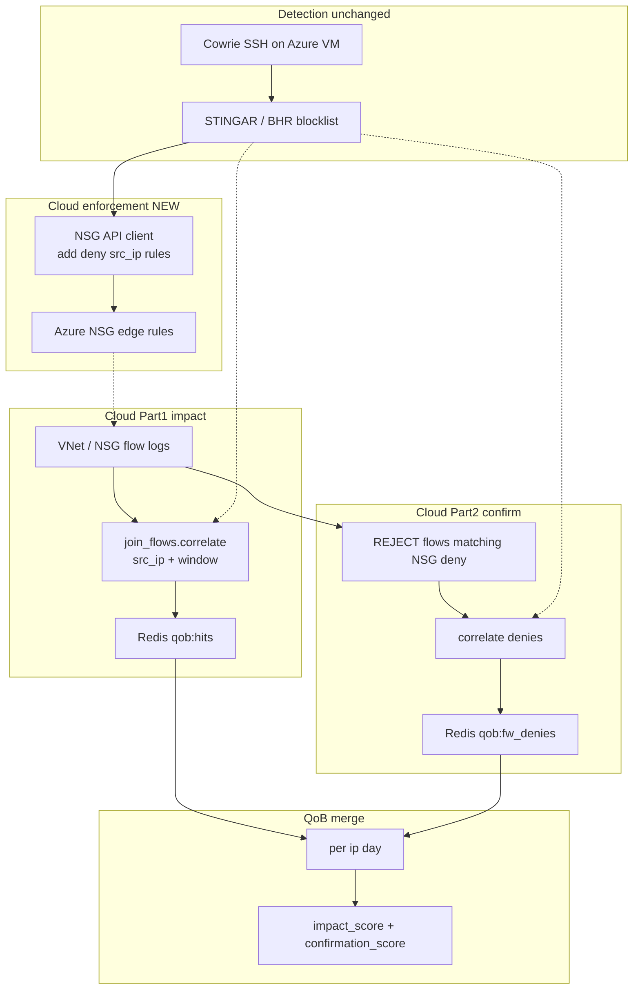

# Cloud SSH honeypot — VPC edge blocking (Azure default)

Companion plan to the [QoB overview](./README.md). This describes the **cloud
parity** track: stand up Cowrie SSH honeypots on virtual hosts in a cloud VPC and
reproduce the on-prem QoB blocking idea using the cloud provider's **edge
firewall** (NSG / Security Group / VPC firewall rules) instead of Duke hardware.

> The on-prem plane (Cowrie → STINGAR → BHR → black-hole router + Palo Alto) is
> mirrored, not changed. The cloud track is a parallel environment we can build
> while access to Duke equipment is pending.

**Default platform:** Azure (VNet + NSG + flow logs). AWS and GCP appear in
equivalence tables only.

---

## Document overview

End-to-end map of this plan — how the sections connect, what you build in order,
and where on-prem QoB maps into the cloud.

**Reading the diagram**

| Section | What it covers |
| --- | --- |
| §0 | On-prem ↔ cloud component mapping; add-vs-mark semantics |
| §1 | Goal (Azure VPC + Cowrie + NSG blocking) and non-goals |
| §2 | Runtime architecture diagram (detection → enforce → measure → score) |
| §3–§6 | Five build steps: deploy → sync blocklist → measure impact → confirm → validate |
| §7 | Existing Python modules to reuse vs new Azure ingest modules |
| §8 | Questions to answer before writing automation |
| §9 | Phased rollout from manual lab to on-prem merge |
| §10 | Links to README, on-prem plans, and RTBH lab |

---

## 0. Relationship to the QoB plan (read first)

This track reproduces on-prem Parts 1 and 2 in a cloud VPC. The mapping:

| On-prem | Cloud (Azure default) |
| --- | --- |
| Cowrie SSH honeypot | Cowrie on Azure VM in honeypot subnet |
| BHR blocklist | Same STINGAR / BHR feed → **NSG rule API** (or local blocklist file for the lab) |
| BH router (RTBH / Null0) | **Route blackhole** or subnet-level drop (TBD in discovery) |
| Palo Alto EDL deny | **NSG deny rule** on the honeypot or edge NSG |
| NetFlow → goflow2 (Part 1) | **NSG / VNet flow logs** |
| PAN Traffic denies (Part 2) | **REJECT** entries in flow logs tied to the NSG deny rule |

Reuse the README's add-vs-mark contract: flow-derived counts drive
`impact_score`; NSG reject confirmations **mark** `edge_confirmed`. As on-prem,
do not sum BH-equivalent bytes and reject bytes for the same packets unless the
paths are proven disjoint.

**On-prem context (neteng 2026):** Duke BHR is **upstream of Palo Alto** and
**instantaneous**; PAN EDL refreshes ~every 5 minutes. Expect **low NSG/FW-style
rejects** when the upstream drop absorbs traffic first — same semantics as Part 2
on-prem (`plan-fw-denies.md` §9).

**Non-goals:** Kubernetes, Cilium, Calico, HTTP / gRPC L7 policies, and AWS WAF
are all out of scope. K8s + Cilium L7 auto-policy generation may be a separate
future doc.

---

## 1. Goal and non-goals

### Goal

Stand up an isolated Azure VNet with Cowrie SSH decoys; push blocked attacker
source IPs to NSG rules via the ARM API; measure dropped traffic via flow logs;
and optionally label Cowrie sessions with ATT&CK techniques — all without Duke
routers or a Palo Alto firewall.

### Non-goals

- Multi-protocol decoys (web / API / gRPC honeypots).
- In-cluster or L7 policy generation.
- Production multi-cloud. v1 is a single Azure lab VPC; AWS / GCP are noted only
  for portability.

---

## 2. Architecture

---

## 3. Azure deployment sketch (Step 1)

Concrete v1 topology:

- Resource group + VNet (e.g. `10.10.0.0/16`).
- Subnets:
  - `honeypot` — Cowrie VM, public IP or load balancer on port 22.
  - `internal` — optional victim decoy for lateral-movement observation.
  - `management` — no public ingress; admin access via allowlisted IP only.
- Cowrie VM (Ubuntu + Docker, or native Cowrie).
- NSG attached to the honeypot subnet / NIC and/or the VNet edge.
- Enable **NSG flow logs** → Log Analytics workspace or a storage account; this
  feeds both Part 1 and Part 2.

Provider equivalence:

| Azure | AWS | GCP |
| --- | --- | --- |
| NSG | Security Group | VPC firewall rule |
| VNet / NSG flow logs | VPC Flow Logs | Firewall Rules logging |
| ARM API | EC2 API | Compute API |

---

## 4. Blocklist sync (Step 2)

A small **cloud blocklist client** (planned code, documented here) polls the BHR
`publist.csv` or the STINGAR feed and adds / removes **inbound deny** rules on
the NSG for each attacker `src_ip`. This is source-based, matching the S/RTBH
assumption in [`plan-netflow-counting.md`](./plan-netflow-counting.md).

Rule intent (pseudo, not full ARM JSON): deny inbound TCP from
`203.0.113.50/32` at a priority above the allow rules.

Operational rules:

- **Naming convention:** `qob-block-{ip-dashed}` so rules are idempotent and
  greppable.
- **Cap:** bound the maximum number of NSG rules; NSGs have per-NSG rule limits
  (see discovery §8).
- **TTL:** remove rules when the IP leaves the BHR list (`removed`), keeping the
  cloud edge in sync with the authoritative blocklist.

---

## 5. Telemetry (Steps 3–4)

**Part 1 (impact).** Parse NSG / VNet flow log records, normalize to the
existing `FlowRecord` shape (`src_ip`, packets, bytes, timestamp), then reuse
[`qob/join_flows.py`](./qob/join_flows.py) and
[`qob/ingest/flow_redis.py`](./qob/ingest/flow_redis.py) unchanged.

**Part 2 (confirm).** Count `flowStatus == REJECT` (or the Azure equivalent)
where the rule matches a QoB NSG deny rule → `fw_deny_count` /
`edge_confirmed`. On-prem, BHR is **upstream of PAN** (neteng 2026), so rejects
are often zero when the upstream drop works first — design the cloud lab the
same way if possible (route blackhole or edge drop before NSG REJECT).

**ATT&CK (optional v1).** Map from **Cowrie session logs**, not network L7:

| Observed (Cowrie) | ATT&CK |
| --- | --- |
| Repeated SSH auth failures | [T1110](https://attack.mitre.org/techniques/T1110/) — Brute Force |
| `cat /etc/shadow`, credential hunting | [T1552](https://attack.mitre.org/techniques/T1552/) — Unsecured Credentials |
| `bash -c`, downloaded script execution | [T1059](https://attack.mitre.org/techniques/T1059/) — Command and Scripting Interpreter |

No auto-policy generation in v1. ATT&CK labels feed analysis only; enforcement
stays **IP-level NSG deny**.

---

## 6. Validation (Step 5)

1. Synthetic attacker VM in the same VNet (or external) brute-forces Cowrie; the
   IP lands on the blocklist and an NSG deny rule is added.
2. Repeat connection attempts show **REJECT** in the flow logs (or zero if a
   route blackhole absorbs the traffic first).
3. Legitimate management SSH from an allowlisted IP still succeeds.
4. Redis keys `qob:hits:*` / `qob:fw_denies:*` populate, reusing the lab
   verification patterns from [`lab/README.md`](./lab/README.md).

Success criteria: blocked attacker IPs stop reaching Cowrie; legitimate
management access is preserved; QoB counters populate for the test IP.

---

## 7. Reuse from the existing codebase

| Existing module | Cloud reuse |
| --- | --- |
| [`qob/join_flows.py`](./qob/join_flows.py) | Same correlate logic on `src_ip` |
| [`qob/ingest/bhr_list.py`](./qob/ingest/bhr_list.py) | Same blocklist loader |
| [`qob/ingest/flow_redis.py`](./qob/ingest/flow_redis.py) | Same Redis store |
| [`qob/scoring.py`](./qob/scoring.py) | Same `impact_score` |
| [`jobs/compute_qob.py`](./jobs/compute_qob.py) | Extend later with `--source azure_flow` |

New modules (documented only, not built in this pass):

- `qob/ingest/azure_flow_logs.py` — parse the flow log export.
- `qob/ingest/azure_nsg.py` — NSG rule sync.
- `collectors/poll_azure_flows.py` — scheduled flow log reader.

---

## 8. Discovery checklist (before build)

**On-prem reference (neteng 2026):** BHR upstream of PAN; source-based RTBH;
BHR instantaneous, PAN EDL ~5 min. Mirror that ordering in the cloud lab if
possible.

1. Where does the drop happen — NSG `REJECT`, or a route blackhole first?
2. NSG rule limit and automation pattern (rule churn at scale).
3. Flow log field names for `src_ip`, `bytes`, `action`, and rule name.
4. Cowrie → STINGAR path in the cloud (Forewarned / Splunk / isolated lab)?
5. Public IP exposure model for the honeypot VM.

---

## 9. Implementation phases

- **Phase 0 — Manual lab.** Azure VNet + Cowrie VM + one hand-added NSG deny
  rule; export one day of flow logs.
- **Phase 1 — Offline correlate.** CSV fixture path for Azure flow logs reusing
  the existing `join_flows` tests.
- **Phase 2 — Automation.** NSG API sync + scheduled flow log ingest → Redis.
- **Phase 3 — Merge.** Wire into `compute_qob` alongside the on-prem path once
  Duke access is available.

---

## 10. References

- [README](./README.md) — QoB overview, add vs mark
- [`plan-netflow-counting.md`](./plan-netflow-counting.md) — Part 1 BH impact (on-prem)
- [`plan-fw-denies.md`](./plan-fw-denies.md) — Part 2 FW confirmation (on-prem)
- [`lab/README.md`](./lab/README.md) — RTBH validation lab
